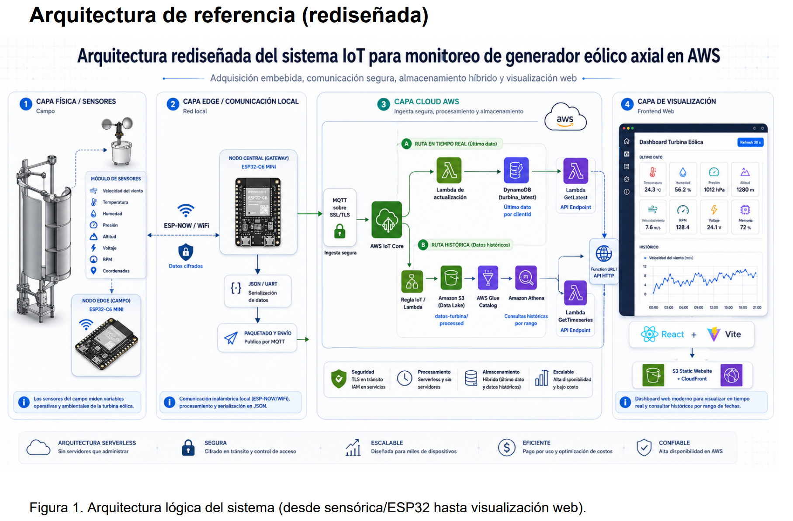
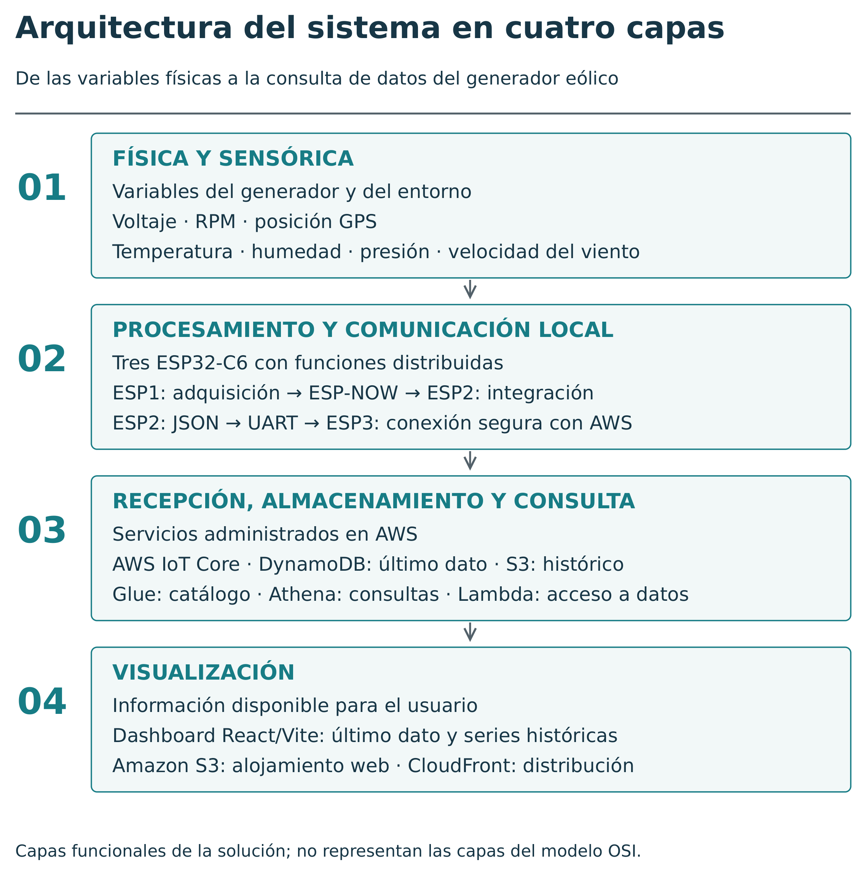
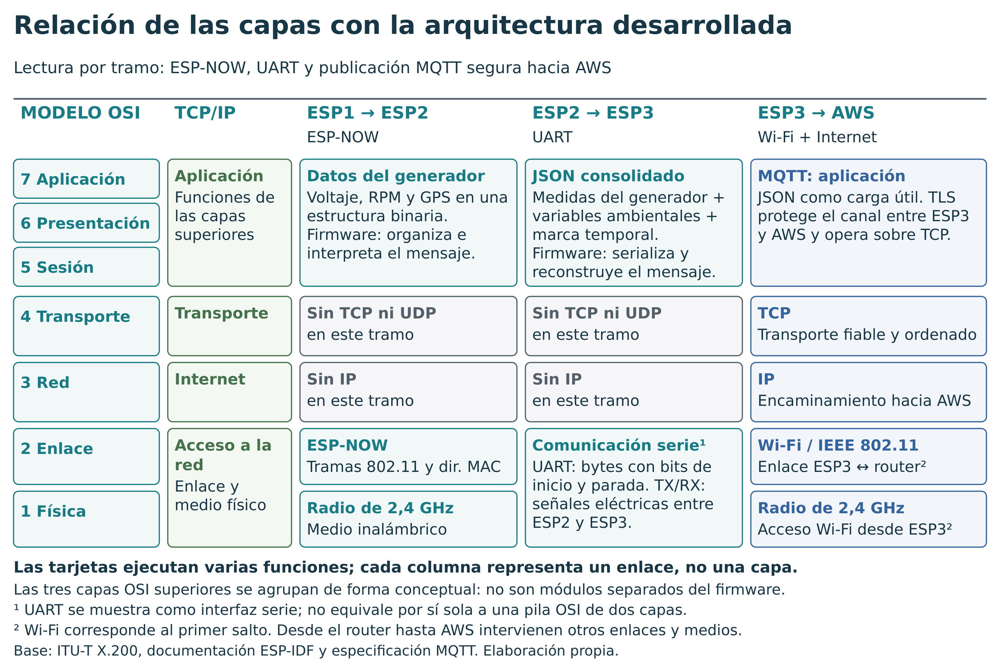
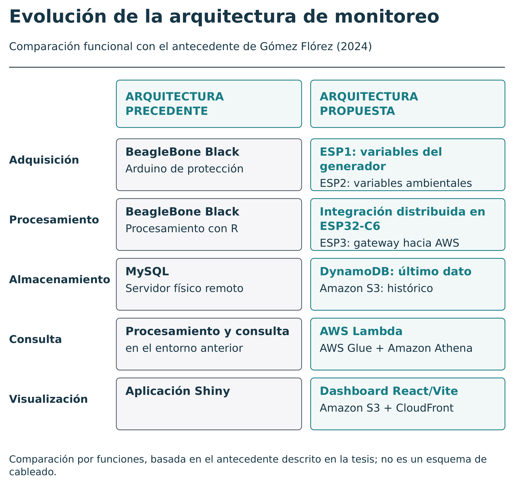

# Marco de referencia

En este capítulo se desarrolla el marco de referencia que soporta la arquitectura propuesta para el monitoreo de un generador eólico de pequeña escala soportado en IoT y procesamiento en la nube de AWS. Para este análisis, el foco se centra en el desarrollo de la arquitectura desde la capa física hasta la capa de visualización, examinando los diferentes protocolos requeridos para la implementación en cada etapa desde la perspectiva de los modelos OSI y TCP/IP. El National Institute of Standards and Technology (NIST, 2016) plantea que las «redes de cosas» integran sensores, agregadores, canales de comunicación, servicios externos y procesos de decisión, por lo cual esta perspectiva permite analizar la arquitectura por capas funcionales. De forma complementaria, AWS (2026g) presenta el enfoque **serverless** como una manera de diseñar y operar aplicaciones en la nube delegando la administración de infraestructura al proveedor, lo que resulta pertinente para el pipeline de adquisición, almacenamiento, procesamiento y visualización que se plantea en este trabajo [@nist_sp800_183; @aws_serverless_lens].

{#fig-arquitectura-referencia width=100% fig-align="center"}

La @fig-arquitectura-referencia, arquitectura de referencia, resume el sistema como una cadena de adquisición, comunicación, recepción, almacenamiento, consulta y visualización de datos. Se propone de esta manera porque se proyectan dos arquitecturas comparables, local frente a nube, y permite determinar de qué manera se pueden aprovechar las oportunidades que ofrecen y evaluar sus limitaciones. En esta línea, Gubbi et al. (2013) explican que una visión cloud-centric del IoT facilita integrar sensores, redes y plataformas de procesamiento para explotar datos provenientes del mundo físico. Por su parte, AWS (2026g) sostiene que las arquitecturas **serverless** permiten reducir la carga operativa asociada a servidores dedicados. A partir de lo anterior, la nube ofrece la flexibilidad de no administrar uno o múltiples servidores locales para implementar todo el pipeline mencionado, por lo que se profundiza en una arquitectura **serverless** donde se paga por uso y se mejora la flexibilidad y la escalabilidad según la demanda del sistema; la seguridad, en cambio, se aborda mediante mecanismos específicos de comunicación segura, certificados, políticas y control de acceso que se desarrollan en apartados posteriores [@ref19; @aws_serverless_lens].

## Internet de las Cosas aplicado a sistemas energéticos

El Internet of Things (IoT), o Internet de las Cosas, puede entenderse como un ecosistema de tecnologías donde se relacionan diversas áreas del conocimiento. Desde la electrónica, se integran dispositivos de hardware con capacidad de sensado de variables físicas; desde los sistemas, se incorporan redes, procesamiento local, protocolos de comunicación y servicios de información que permiten transformar observaciones del mundo físico en datos explorables. El NIST (2016) explica que las redes de cosas articulan objetos físicos y componentes computacionales para observar el entorno y generar información útil. En el caso de pequeños sistemas eólicos, Wang et al. (2023) señalan que las turbinas eólicas de pequeña escala tienen potencial para integrarse con aplicaciones IoT, especialmente cuando se requiere monitorear variables ambientales, eléctricas y mecánicas. En el generador eólico de prueba de este trabajo, el sistema IoT interconecta los sensores de capa física con una infraestructura que permite la estructuración, transporte, almacenamiento y procesamiento de esa información en servicios de AWS, convirtiéndolo en un sistema ciberfísico que ofrece trazabilidad de la información, diagnóstico operativo y bases de datos históricas para soportar análisis posteriores [@nist_sp800_183; @ref4] [@atzori_iot_survey_2010; @botta_cloud_iot_2016; @sisinni_industrial_iot_2018].

Si se analiza un sistema IoT desde una perspectiva de funcionamiento, se podría dividir en tres dominios de operación diferentes: el dominio físico, donde se ubican las variables a medir, como temperatura, voltaje y velocidad del viento; el dominio embebido o Edge, donde se capturan, filtran y estructuran los datos medidos; y el dominio de plataforma, donde se almacenan, consultan y visualizan los datos. Al-Fuqaha et al. (2015) describen el IoT como un conjunto de tecnologías habilitadoras, protocolos y aplicaciones que permiten conectar objetos, redes y servicios; esta interpretación permite organizar el sistema de este trabajo en capas. En nuestro caso, el planteamiento anterior se materializa a través de la sensórica para medir variables del proceso eólico y estructurarlas en dimensión temporal, como el **BME680**, el anemómetro, el **DS3231** y los sensores de pulsos. También se materializa en tres tarjetas **ESP32-C6**, las cuales cuentan con múltiples protocolos de comunicación que operan en varias capas, como **I2C**, **SPI**, **UART**, **MQTT**, **SSL/TLS**, HTTP, **ESP-NOW**, Zigbee y Thread. Finalmente, se implementa una plataforma en AWS soportada en servicios como **AWS IoT Core**, **DynamoDB**, **S3**, Glue, **Athena**, **Lambda**, **CloudFront**, **CloudTrail** y **CloudWatch**. AWS (2026a) permite sustentar esta selección al documentar que **AWS IoT Core** soporta protocolos como **MQTT** sobre **TLS** para conectar dispositivos con servicios cloud [@ref21; @aws_iot_protocols].

En esta investigación, la arquitectura puede interpretarse como la integración entre una capa de hardware/sensado como servicio (HaaS) y una capa de software como servicio (SaaS). La primera convierte variables físicas del generador eólico en telemetría estructurada; la segunda permite que esos datos sean almacenados, consultados y visualizados mediante servicios cloud, sin que el usuario final administre servidores o bases de datos locales [@mell_grance_nist_cloud_2011; @perera_sensing_service_2013; @botta_cloud_iot_2016; @marjani_big_iot_2017].

En sistemas energéticos, la importancia del IoT y la modernización de los sistemas de comunicación surge porque se requiere monitorear variables de diversas naturalezas para conocer la condición operativa y establecer relaciones o patrones con otro tipo de variables. Wang et al. (2023) muestran que los sistemas eólicos pequeños pueden beneficiarse de aplicaciones IoT porque estas permiten capturar datos de operación y del entorno para análisis posteriores. Tchakoua et al. (2014) también destacan que el monitoreo de condición en turbinas eólicas requiere observar variables mecánicas, ambientales y eléctricas para apoyar diagnóstico y mantenimiento. Por ejemplo, la potencia eólica depende de la velocidad del viento y de la densidad del aire, siendo la densidad del aire una variable relacionada con la presión atmosférica y la temperatura. A su vez, la potencia eléctrica depende de la velocidad de rotación del rotor de la turbina y de las condiciones de generación. De allí que se requieran sistemas electrónicos que permitan la observabilidad permanente de estos sistemas para evaluar desempeño, detectar anomalías, identificar fallas y construir modelos de operación y predicción que contribuyan al mejoramiento de la gestión del proceso. El NIST (2019) complementa este argumento al indicar que en sistemas IoT deben considerarse la seguridad, la confiabilidad y la integridad de los datos durante el ciclo de vida del dispositivo [@ref4; @ref35] [@ref22; @ref23; @ref24; @ref31; @foley_wind_forecasting_2012].

La arquitectura IoT propuesta en este trabajo se plantea como una solución con nodos distribuidos. Esta decisión se entiende mejor al compararla con el trabajo desarrollado previamente por Gómez Flórez (2024), donde se trabajaba con una tarjeta BeagleBone Black para la medición de variables, un Arduino de protección, almacenamiento en MySQL, procesamiento en R y visualización con Shiny. A partir de esa tesis raíz, la nueva arquitectura propone una evolución hacia tres tarjetas **ESP32-C6**, las cuales poseen menor capacidad de procesamiento que una BeagleBone Black, pero son más económicas, tienen menor consumo y permiten distribuir funciones en nodos especializados. En lugar de concentrar todas las funciones en un único nodo, se separan las tareas en adquisición de variables de generación en la ESP1, adquisición de variables ambientales e integración local en la ESP2, y gateway hacia AWS en la ESP3. Esta separación se sustenta en la lectura distribuida de los sistemas IoT planteada por el NIST (2016) y en la documentación de Espressif Systems (2026a), que presenta **ESP-NOW** como una alternativa de comunicación local entre dispositivos ESP. Esta organización reduce complejidad por módulo, permite aprovechar las capacidades de cada ESP, mejora la depuración por etapas y permite reemplazar o ampliar sensores sin rediseñar toda la cadena de comunicación [@gomez_prototipado_2024; @espressif_espnow] [@ref7; @ref8; @ref10; @ref39].

## Arquitectura de referencia del sistema propuesto

Debido a la naturaleza del sistema y a la división por nodos adecuados a la distribución física y espacial del sistema eólico, se plantea una arquitectura de referencia con cuatro capas: física y sensórica, Edge o comunicación local, capa cloud para ETL y capa cloud para visualización. El NIST (2016) permite justificar esta división al considerar que las redes de cosas se componen de sensores, canales de comunicación, agregadores y servicios externos que permiten convertir eventos físicos en información digital. AWS (2026e), por su parte, permite sustentar el uso de funciones **Lambda** como mecanismo para exponer servicios HTTP ligeros dentro de una arquitectura cloud. Esta estructura permite explicar con mayor detalle cuál es el rol que cumple cada componente, como sensores, **DS3231**, pantalla **OLED** y memoria **SD**; cuál protocolo se usa en cada tramo; por qué se usa; y cuáles riesgos surgen cuando se pasa de señales físicas a información consultable desde un dashboard expuesto a la web [@nist_sp800_183; @aws_lambda_function_urls] [@ref19; @ref21; @atzori_iot_survey_2010; @botta_cloud_iot_2016].

{#fig-cap2-cuatro-capas width=100% fig-align="center" fig-pos="H"}

La @fig-cap2-cuatro-capas presenta las cuatro capas descritas en esta sección. Los sensores dan origen a las mediciones; las tarjetas las organizan y transmiten; los servicios de AWS las almacenan y permiten consultarlas; y el dashboard las presenta al usuario.

La primera capa corresponde al entorno físico del generador eólico de eje vertical y sus variables asociadas. En esta capa se ubican sensores y dispositivos necesarios para el funcionamiento adecuado de la arquitectura. En la ESP1, ubicada a la altura del generador, se mide la velocidad de la turbina contando sus RPM con un sensor de efecto Hall, se mide el voltaje a partir del acondicionamiento de la señal sinusoidal y del uso del conversor análogo-digital, y se integra un módulo **GPS** para obtener información de ubicación del dispositivo. En la ESP2, ubicada a una altura media o alta de la turbina, se leen los datos del sensor **BME680**, el cual provee datos de presión atmosférica, temperatura, humedad y altitud; también se toma la fecha y hora del reloj de tiempo real **DS3231**, la velocidad del viento del anemómetro mediante pulsos, interrupciones y temporizadores, el uso de **memoria SD** para almacenamiento temporal de muestras y la pantalla **OLED** para visualización local de datos. Esta capa se relaciona con Gómez Flórez (2024), quien ya había trabajado la adquisición de variables físicas en turbinas eólicas de eje vertical, aunque con una arquitectura diferente basada en BeagleBone Black y servidor físico remoto [@gomez_prototipado_2024; @bosch_bme680_datasheet] [@ref4; @ref35; @bhutta_vawt_review_2012; @eriksson_turbine_concepts_2008; @calautit_micro_wind_2023].

La segunda capa corresponde al procesamiento Edge en el sistema embebido, para este caso el SoC **ESP32-C6**. Espressif Systems (2026a) documenta **ESP-NOW** como un protocolo de comunicación **Wi-Fi** sin conexión que permite enviar datos entre dispositivos ESP sin construir una red IP completa, lo cual justifica su uso entre la ESP1 y la ESP2. En esta capa, la ESP1 envía los datos medidos y estructurados a la ESP2 mediante **ESP-NOW**. La ESP2 consolida todos los datos en una estructura **json** y la transmite por **UART** a la ESP3, que actúa como gateway. La ESP3 recibe el paquete de datos, lo reconstruye, gestiona la conexión a la red Wi-Fi y la comunicación con **AWS IoT Core** mediante **MQTT** sobre **SSL/TLS**, y se encarga de enviar los datos una vez se conecta al tópico seguro. El NIST (2019) advierte que los sistemas IoT deben gestionar riesgos de seguridad, privacidad e integridad de los datos; por eso, esta etapa es clave, ya que los errores que aquí ocurren pueden propagarse a través del sistema hasta alojarse en la base de datos y generar análisis erróneos [@espressif_espnow; @nist_ir_8228] [@sisinni_industrial_iot_2018; @quincoces_mqtt_2019; @ref21; @ref10].

La tercera capa corresponde a la recepción de datos en **AWS IoT Core** mediante **MQTT** seguro, el almacenamiento del último dato en **DynamoDB**, el almacenamiento histórico en **Amazon S3**, la gestión de ETL histórico mediante **Athena**, Glue y **S3**, y la exposición web mediante **Lambda**. AWS (2026g) presenta **AWS IoT Core** como un servicio orientado a la comunicación segura entre dispositivos y la nube mediante protocolos como **MQTT**, mientras que AWS (2026l) describe **Lambda** Function URLs como una alternativa para exponer funciones mediante HTTPS sin desplegar un servidor propio. Para la capa de datos, AWS (2026c) permite sustentar el uso de **DynamoDB** con claves primarias para identificar ítems, AWS (2026m) documenta el uso de prefijos en **S3** para organizar objetos, y AWS (2026a) explica que **Athena** utiliza **AWS Glue** Data Catalog para almacenar metadatos de tablas, columnas y datos ubicados en **S3**. La división entre “último dato” e “histórico” permite generar un monitoreo más constante y responder a una visualización más extensa de los datos cuando se requiera. Esta separación también permite que el sistema no consulte permanentemente el histórico para mostrar información operativa reciente, lo cual ayuda a controlar costos y tiempos de respuesta [@aws_iot_protocols; @aws_dynamodb_core_components; @aws_s3_prefixes; @aws_athena_glue_catalog] [@hashem_bigdata_cloud_2015; @marjani_big_iot_2017; @botta_cloud_iot_2016].

La cuarta capa corresponde a la exposición de los datos al usuario. Las funciones **Lambda** con URL pública controlada actúan como API entre el almacenamiento y el dashboard web, mientras que **React/Vite**, **S3** y **CloudFront** permiten presentar una actualización de los datos cada 30 segundos y series históricas temporales de cada variable registrada. AWS (2026k) explica que las configuraciones **CORS** son necesarias cuando una aplicación web consulta recursos desde un origen distinto, y AWS (2026l) permite sustentar el uso de **Lambda** Function URLs como mecanismo ligero de exposición HTTP. Esta capa se debe diseñar teniendo en cuenta los tiempos de respuesta de cada consulta, el control de errores identificados y las restricciones de consulta para evitar la elevación de los costos de ETL o el aumento de latencias injustificadas [@aws_lambda_function_urls; @aws_lambda_url_cors].

## Modelos OSI y TCP/IP como marco de lectura de la arquitectura

Este trabajo se aborda desde la mirada de los modelos OSI y TCP/IP, siendo TCP/IP el modelo que se implementa en la práctica. El modelo OSI es útil porque explica de manera ordenada y detallada en qué nivel se gestiona cada función de la comunicación. IEEE Standards Association (2016) permite comprender la operación de redes inalámbricas en términos de funciones de capa física y de enlace, mientras que Eddy (2022) especifica TCP como protocolo de transporte orientado a conexión y entrega confiable. En el sistema de prueba que se implementa, la lectura por capas facilita la distinción entre señales a nivel de capa física, transmisión en capa de enlace, red IP, transporte seguro mediante **TLS** y aplicación de telemetría en las capas superiores [@iso_ieee_8802_11_2018; @rfc9293].

En la implementación real se hace uso del estándar TCP/IP, el cual simplifica el modelo OSI en cuatro capas: acceso a la red, Internet, transporte y aplicación. Espressif Systems (2026d) permite sustentar que **ESP-NOW** opera como un protocolo **Wi-Fi** sin conexión entre dispositivos ESP, principalmente sin requerir direccionamiento IP. En cambio, AWS (2026g) muestra que la salida hacia **AWS IoT Core** requiere conexión Wi-Fi, asignación de dirección IP, establecimiento de sesión TCP, negociación **TLS** y publicación mediante **MQTT** hacia un broker administrado por AWS. Por esta razón, el sistema combina tramos no IP en la comunicación local con un tramo IP seguro hacia la nube [@espressif_espnow; @aws_iot_protocols; @rfc8446].

```{=latex}
\begin{landscape}
```

{#fig-cap2-osi-tramos width=100% fig-align="center" fig-pos="H"}

```{=latex}
\end{landscape}
```

La @fig-cap2-osi-tramos se lee por filas y por tramos de comunicación. ESP1 y ESP2 intercambian datos mediante ESP-NOW sobre tramas IEEE 802.11; ESP2 transmite el JSON consolidado por UART a ESP3; y ESP3 publica mediante MQTT sobre TLS, TCP e IP, con Wi-Fi en el acceso al router. Las tarjetas no corresponden a una sola capa. La comunicación serie se muestra como una interfaz local, sin atribuirle una pila OSI completa. La tabla siguiente conserva una lectura funcional del sistema: la fila de seguridad agrupa controles y no constituye una capa adicional del modelo OSI [@espressif_espnow; @espressif_uart_driver; @oasis_mqtt5; @rfc9293; @rfc8446].

| Capa conceptual | Implementación en el prototipo | Función técnica |
| --- | --- | --- |
| Física | Sensores, ADC, GPIO, UART, radio 2.4 GHz | Captura y transporte físico de señales |
| Enlace | ESP-NOW, Wi-Fi/IEEE 802.11, direccionamiento MAC | Comunicación local y acceso inalámbrico |
| Red | IP sobre Wi-Fi en ESP3 | Conectividad hacia Internet |
| Transporte | TCP para MQTT/TLS | Entrega confiable extremo a extremo |
| Seguridad | TLS, certificados X.509, políticas IoT | Autenticación, cifrado e integridad |
| Aplicación | MQTT, json, Lambda URL, dashboard | Telemetría, consulta y visualización |

: Lectura por capas de la arquitectura IoT propuesta. {#tbl-cap2-lectura-capas}

La Tabla nro. 2.1 muestra que no todas las comunicaciones son iguales en el sistema. El tramo ESP1–ESP2, aunque se comunica a través de radiofrecuencia de 2.4 GHz mediante **ESP-NOW**, no requiere dirección IP, ya que se soporta en la dirección MAC única de cada ESP. La comunicación entre ESP2 y ESP3 se hace a través de **UART** a 9600 baudios. Mientras tanto, la comunicación ESP3–AWS sí depende de conexión Wi-Fi, direccionamiento IP, TCP y **TLS**. Eddy (2022) permite sustentar el papel de TCP en la entrega confiable de datos, mientras que Rescorla (2018) fundamenta el uso de **TLS** como protocolo de seguridad para proteger la comunicación. Esta aclaración es importante porque ayuda a identificar las diferentes etapas del sistema y los criterios de decisión que permiten aprovechar mejor los recursos disponibles, combinando comunicación local de baja complejidad con publicación cloud segura, eficiente y económica [@rfc9293; @rfc8446].

La lectura por capas también permite identificar y clasificar de mejor manera los riesgos. El NIST (2019) explica que los sistemas IoT presentan riesgos asociados con la seguridad, privacidad, disponibilidad, integridad y confiabilidad de los datos. En la capa física pueden predominar errores de medición, ruido, falta de mantenimiento, daños en los sensores o problemas de cableado. En la capa de enlace pueden generarse pérdidas de paquetes, interferencia, colisiones o pérdida de comunicación en buses como **I2C**. En la capa de transporte se deben tener en cuenta las reconexiones y las latencias. En sesión y presentación se evalúan aspectos de seguridad, certificados, claves y permisos. Finalmente, en la capa de aplicación se revisa la consistencia del **json**, la validación de campos, los errores HTTP y las consultas históricas. AWS (2026f) complementa esta lectura al señalar que las políticas de **AWS IoT Core** permiten autorizar acciones específicas sobre recursos determinados, lo cual resulta necesario cuando los dispositivos publican datos hacia la nube [@nist_ir_8228; @aws_iot_policies] [@ref37; @ref39; @ref40; @ref41].

## Protocolos de comunicación local: **ESP-NOW** y **UART**

**ESP-NOW** es un protocolo propio de los dispositivos ESP soportado por Espressif para el entorno local de **esp-idf**. Espressif Systems (2026d) describe **ESP-NOW** como un protocolo de comunicación **Wi-Fi** sin conexión que permite comunicación directa entre dispositivos ESP mediante tramas de acción específicas, incluyendo registro de pares, callbacks de envío o recepción y transmisión de datos entre dispositivos. En este caso, se usa **ESP-NOW** porque es un protocolo flexible que permite intercomunicar dos o más ESP32 a través de sus direcciones MAC en la banda de 2.4 GHz, evitando construir una red IP completa. Esto es conveniente cuando se deben transmitir datos a un nodo integrador y se quiere reducir la complejidad de red. No obstante, su uso exige registrar pares de tarjetas, controlar direcciones MAC y configurar seguridad para garantizar cifrado en la transmisión cuando el sistema lo requiera [@espressif_espnow; @iso_ieee_8802_11_2018].

Dentro de la arquitectura, **ESP-NOW** se ubica en un nivel diferente a **MQTT**. En la especificación MQTT Version 5.0, OASIS (2019) define **MQTT** como un protocolo de mensajería publish/subscribe basado en clientes, broker y tópicos, mientras que Espressif Systems (2026d) presenta **ESP-NOW** como una comunicación local entre dispositivos ESP. Por ello, **MQTT** se asocia a la telemetría que sale hacia Internet y **AWS IoT Core**, mientras que **ESP-NOW** permite la comunicación entre ESPs en la red local, sin depender de un broker ni de conectividad IP. En este trabajo, **ESP-NOW** se presenta como un protocolo de borde o Edge que, aunque no pertenece a la capa cloud, brinda prestaciones útiles para sistemas IoT distribuidos en espacios físicos donde se requiere comunicación local ligera [@oasis_mqtt5; @espressif_espnow].

Por otra parte, la comunicación **UART** entre ESP2 y ESP3 cumple una función diferente. Espressif Systems (2026h) documenta **UART** como un mecanismo de comunicación serial que permite transmisión y recepción de datos mediante un controlador dedicado. En este proyecto, la ESP3 puede estar cerca de la ESP2, por lo que se aprovecha **UART** para transferir el **json** consolidado desde el nodo integrador hacia el gateway de AWS y no interferir con la comunicación Wi-Fi de la ESP3. Aunque **UART** es un protocolo simple y robusto para distancias cortas, el NIST (2019) permite recordar que los sistemas IoT deben cuidar la integridad y confiabilidad de los datos transmitidos. Por ello, se deben tener en cuenta sus limitaciones y configuraciones de delimitadores, tamaño máximo de trama, control de errores y criterios de descarte para evitar publicar mensajes incompletos o corruptos en AWS [@espressif_uart_driver; @nist_ir_8228].

Desde el punto de vista de diseño, esta fue la solución propuesta a los problemas que surgieron en el camino con la adquisición y transmisión de datos en cada etapa. La combinación **ESP-NOW** + **UART** responde a la necesidad de comunicación en el espacio del generador eólico, aunque esta situación puede cambiar en otros sistemas y requerir nuevas arquitecturas. Espressif Systems (2026d) sustenta la comunicación local mediante **ESP-NOW**, mientras que AWS (2026g) permite sustentar la necesidad de conectar finalmente el sistema a una plataforma cloud mediante **MQTT** seguro. A su vez, esta combinación permite separar el dominio inalámbrico local del dominio de publicación a Internet, reduciendo la carga funcional sobre los diferentes nodos y especializando cada tarjeta en funciones específicas. Esta decisión también marca una diferencia frente a Gómez Flórez (2024), donde la arquitectura previa concentraba mayor parte del procesamiento en una BeagleBone Black y un servidor físico remoto [@espressif_espnow; @aws_iot_protocols; @gomez_prototipado_2024].

{#fig-cap2-comparacion-arquitecturas width=100% fig-align="center" fig-pos="H"}

La @fig-cap2-comparacion-arquitecturas organiza la comparación por adquisición, procesamiento, almacenamiento, consulta y visualización. Permite reconocer qué funciones se conservan y cómo cambia su distribución entre dispositivos y servicios; no representa el cableado del sistema anterior [@gomez_prototipado_2024].

```{=latex}
\FloatBarrier
```

## **MQTT**, telemetría y contrato de datos

**MQTT**, Message Queuing Telemetry Transport, es un protocolo de mensajería de tipo publish/subscribe diseñado para escenarios donde usuarios o clientes publican mensajes a un broker mediante tópicos. OASIS (2019) define **MQTT** como un protocolo orientado a clientes ligeros, lo cual lo hace apropiado para sistemas IoT con recursos limitados. En este trabajo, la ESP3 opera como cliente **MQTT**, **AWS IoT Core** funciona como broker administrado y el mensaje **json** es la unidad de telemetría que viaja desde el prototipo hasta la nube. AWS (2026g) complementa este planteamiento al documentar que **AWS IoT Core** soporta comunicación segura de dispositivos mediante **MQTT** sobre **TLS** [@oasis_mqtt5; @aws_iot_protocols].

Para esta arquitectura, se usa la estructura de datos **json** como contrato de datos por varias razones. **MQTT** transporta mensajes de aplicación, pero no define por sí mismo la estructura interna del payload; por eso, se requiere un contrato estable para que el firmware y la nube interpreten los mismos campos. Por un lado, **json** es un formato legible y con facilidad de depuración durante pruebas. Por otra parte, es compatible con los servicios de AWS, por lo que esta estructura actúa como una interfaz estable entre el firmware del sistema físico, las reglas IoT, **DynamoDB**, **S3**, **Athena**, **Lambda**, Glue y la visualización. En este punto, AWS (2026k) permite reforzar el papel de **Lambda** como interfaz HTTP para entregar respuestas estructuradas hacia aplicaciones web, aunque la definición específica de nombres de campos, tipos de datos y unidades corresponde al diseño del contrato de datos de este proyecto. Por lo anterior, es importante garantizar la persistencia en los nombres de los campos, tipos de datos y unidades que deben permanecer consistentes [@aws_iot_rules; @aws_lambda_function_urls].

El contrato de datos planteado incorpora información de las variables físicas y metadatos del sistema. El NIST (2016) señala que los sistemas IoT deben transformar observaciones físicas en datos útiles para sistemas digitales, mientras que el NIST (2019) advierte la necesidad de conservar trazabilidad, integridad y gestión de riesgos sobre esa información. En este trabajo, las variables describen la dinámica física en función del tiempo: temperatura, velocidad del viento, velocidad de la turbina, humedad, voltaje y presión atmosférica. Los metadatos permiten medir trazabilidad: clientId, timestamp, estado de conexión, estado de la memoria y otros campos que se contemplen para monitorear procesos clave de la ESP. Esta estructura permite analizar el comportamiento energético y operativo del sistema IoT [@nist_sp800_183; @nist_ir_8228].

Una buena práctica de arquitectura es separar o distinguir entre el tópico **MQTT**, el identificador del dispositivo y la estructura del payload. OASIS (2019) permite sustentar que **MQTT** organiza la mensajería mediante tópicos, mientras que AWS (2026g) permite administrar la comunicación de dispositivos en **AWS IoT Core**. En este sentido, el tópico recepciona y organiza el flujo de los mensajes, el clientId identifica la fuente de telemetría y el **json** estructura los valores medidos. Mezclar estas responsabilidades o no asignar una distinción clara tiende a dificultar el escalamiento a múltiples sistemas y complica las consultas históricas por dispositivo [@oasis_mqtt5; @aws_iot_protocols].

## Seguridad: **TLS**, certificados **X.509** y principio de mínimo privilegio

Al tratarse de una arquitectura donde no todas las comunicaciones son iguales, la seguridad debe analizarse por tramos. En el tramo ESP1–ESP2, red local soportada en **ESP-NOW**, se puede operar con cifrado mediante claves PMK/LMK configurando pares seguros y con una adecuada gestión de credenciales, direcciones y secretos para salvaguardar la seguridad de los nodos. Espressif Systems (2026d) documenta mecanismos de seguridad para proteger tramas en **ESP-NOW**. Sin embargo, el tramo ESP3–AWS funciona de forma diferente, ya que **AWS IoT Core** requiere autenticación de dispositivos a través de certificados **X.509** y comunicación **MQTT** segura sobre **TLS**. AWS (2026j) permite sustentar que los certificados **X.509** se usan para autenticar clientes en **AWS IoT Core**, mientras que AWS (2026i) establece que las comunicaciones hacia el Device Gateway deben cifrarse en tránsito mediante **TLS**. Esta separación permite diferenciar la seguridad de borde, la seguridad de transporte y la autorización en servicios cloud [@espressif_espnow; @aws_iot_x509; @aws_iot_security_best_practices] [@ref10; @ref37; @ref39; @ref40].

La protección de los datos es fundamental en este tipo de sistemas. Rescorla (2018) explica que **TLS** protege la comunicación frente a escucha, manipulación y falsificación de mensajes en el canal cliente-servidor. Por eso, exigir implementación de **SSL/TLS** no es un capricho, sino una necesidad técnica cuando la ESP3 se expone publicando datos hacia Internet. AWS (2026g) también sustenta esta necesidad al indicar que **AWS IoT Core** requiere cifrado en tránsito para los protocolos de aplicación soportados, como **MQTT** y HTTP. En este prototipo, la sincronización de hora juega un rol esencial, por eso se maneja un **DS3231** y se implementa la conexión con servidores de tiempo mediante SNTP desde la ESP3. Esto se requiere para establecer una conexión confiable con **AWS IoT Core** a través de **TLS**/**X.509** y para conservar trazabilidad temporal de los datos [@rfc8446; @aws_iot_protocols].

Adicionalmente, el uso de certificados **X.509** permite que cada dispositivo tenga una identidad criptográfica propia otorgada por **AWS IoT Core** y embebida mediante el firmware en la ESP. AWS (2026j) permite sustentar que **AWS IoT Core** valida los certificados **X.509** durante la autenticación del cliente. Esto incrementa la seguridad del sistema, pero también agrega complejidad y responsabilidades adicionales relacionadas con el manejo adecuado de certificados, rotación, versionamiento, manejo seguro durante pruebas, monitoreo del funcionamiento adecuado del **DS3231** y actualizaciones propias de **esp-idf**. El NIST (2019) complementa este punto al advertir que los sistemas IoT deben gestionar riesgos de seguridad desde el diseño y durante todo su ciclo de vida [@aws_iot_x509; @nist_ir_8228].

En AWS, el principio de mínimo privilegio pretende que la política IoT permita únicamente las acciones necesarias para el dispositivo, tales como conexión o publicación en tópicos específicos. AWS (2026f) plantea que **AWS IoT Core** usa políticas para autorizar acciones sobre recursos determinados. Las buenas prácticas en la asignación de permisos garantizan que cada función o rol asignado haga lo que le corresponde, cumpliendo la función asignada sin comprometer la seguridad de los demás elementos y dejando la puerta abierta para escalar a más dispositivos sin dificultad para la asignación de políticas [@aws_iot_policies; @aws_iot_security_best_practices].

## Arquitecturas **serverless** y **Big Data** para telemetría IoT

Una arquitectura **serverless**, o sin servidor, es una forma de desarrollo en la nube en la cual el cliente se enfoca principalmente en su solución debido a que la administración de la infraestructura es responsabilidad del proveedor de servicios. AWS (2026n) plantea que este enfoque permite diseñar, desplegar y operar cargas **serverless** en la nube sin administrar servidores dedicados. Para este proyecto, la arquitectura cloud usa **AWS IoT Core**, **Lambda**, **DynamoDB**, **S3**, Glue, **Athena** y **CloudFront** para recibir, procesar, almacenar, consultar y visualizar datos sin necesidad de desplegar una instancia EC2. Esta decisión se articula con el propósito planteado desde el anteproyecto, donde se buscaba migrar desde una arquitectura previa basada en servidor físico hacia una arquitectura soportada en servicios de nube [@aws_serverless_lens; @aws_iot_protocols].

La visualización o monitoreo se separa en dos etapas que impactan directamente la arquitectura. Por una parte, la obtención del “último dato” es una decisión central, que permite obtener el último dato reportado a AWS por cualquier turbina mediante clientId para visualizarse en cards que se actualizan cada 30 segundos. AWS (2026g) permite sustentar la recepción de la telemetría mediante **AWS IoT Core**, mientras que AWS (2026c) permite sustentar el uso de **DynamoDB** para organizar datos en tablas, ítems, atributos y claves primarias. Por otra parte, se establece el manejo del “histórico” a través de **S3**, Glue y **Athena**, el cual responde a la necesidad de consulta del usuario en la capa de visualización, por ejemplo, última hora o últimas 24 horas. AWS (2026b) permite sustentar la necesidad de particionar datos en **Athena** para mejorar la eficiencia de las consultas, AWS (2026a) explica la relación entre **Athena** y Glue Data Catalog, y AWS (2026k) permite sustentar el uso de **Lambda** como capa de consulta. Esta separación permite optimizar costos, latencia y carga de la aplicación [@aws_iot_protocols; @aws_dynamodb_core_components; @aws_athena_glue_catalog].

El uso de **S3**, Glue y **Athena** convierte la telemetría proveniente de la ESP3 en un repositorio confiable y escalable que se puede consultar mediante SQL. Sin embargo, debe tenerse presente que para que esta ruta sea eficiente se deben estructurar los **json** recibidos en **AWS IoT Core** en particiones temporales, controlar el tamaño de los objetos, limitar los rangos consultados y controlar la cantidad de consultas al día, dado que en esta arquitectura se paga por uso y el mayor consumo puede concentrarse en las consultas históricas. AWS (2026m) explica que los prefijos permiten organizar objetos en **S3** de forma jerárquica, AWS (2026a) permite sustentar la catalogación de metadatos con Glue Data Catalog y AWS (2026b) explica que el particionamiento permite reducir datos escaneados cuando las consultas filtran por claves de partición. Esta lógica también permite proyectar el sistema hacia escenarios de **Big Data**, no porque el prototipo inicial ya produzca grandes volúmenes de información, sino porque la arquitectura se diseña para soportar crecimiento futuro en cantidad de dispositivos, frecuencia de publicación y volumen histórico [@aws_s3_prefixes; @aws_athena_glue_catalog; @aws_athena_partitions].

Para interconectar la sección de almacenamiento con el frontend de visualización se implementan funciones **Lambda** de AWS, las cuales permiten ejecutar código bajo demanda y actuar como intermediarias detrás de cada solicitud del usuario. AWS (2026k) describe **Lambda** Function URL como una función integrada que permite exponer una función **Lambda** mediante HTTPS, actuando como una API ligera para el dashboard. En este trabajo, esto limita que el dashboard consulte directamente las fuentes de datos, como **DynamoDB** o **S3**. En lugar de ello, el usuario realiza peticiones HTTP de tipo GET desde el dashboard a la URL de la función **Lambda**, y esta centraliza la validación de parámetros, la consulta específica a **S3** mediante **Athena** y Glue, la normalización de la respuesta en estructura **json** y la aplicación de políticas de acceso desde el navegador mediante **CORS**. AWS (2026l) permite sustentar la importancia de **CORS** para controlar las solicitudes entre diferentes orígenes en aplicaciones web [@aws_lambda_function_urls; @aws_lambda_url_cors].

Como proyección, la separación entre información reciente e histórica puede explorarse en plataformas de supervisión de sistemas de potencia. Llevar esta idea al estudio de estabilidad requeriría definir otras variables, escalas de muestreo, condiciones de sincronización y tiempos de respuesta. Ese desarrollo queda fuera de la validación presentada: el prototipo se utiliza para monitoreo de la turbina y no implementa funciones de protección ni control de estabilidad.

## Computación en el borde y gestión de concurrencia

**Edge Computing**, o computación en el borde, es una práctica que permite ejecutar parte del procesamiento en la fuente u origen de los datos, en este caso, en las tarjetas **ESP32-C6** que miden las variables del proceso. El NIST (2016) permite sustentar esta idea al considerar que los sistemas IoT no solo capturan datos, sino que también pueden realizar procesamiento local antes de enviar información a servicios externos. Esto reduce la dependencia de conectividad permanente y evita enviar datos desorganizados a la nube o a un servidor remoto. El firmware que se crea para el proceso local permite que estas tarjetas se comuniquen con los sensores, ejecuten los algoritmos de lectura de datos, cuenten pulsos combinando interrupciones y temporizadores de alta precisión, consoliden los datos en múltiples estructuras, serialicen la información y la publiquen en AWS, facilitando el procesamiento y la integridad del proceso. Espressif Systems (2026e) permite sustentar el uso de **FreeRTOS** en **esp-idf** para manejar tareas, sincronización y concurrencia en dispositivos **ESP32-C6** [@nist_sp800_183; @espressif_freertos] [@sisinni_industrial_iot_2018; @atzori_iot_survey_2010].

Las tarjetas ESP32 se definen como SoC, System on Chip, y pueden programarse de múltiples maneras, principalmente a partir de su entorno nativo **esp-idf** con lenguaje C y C++, aunque también existen alternativas como MicroPython. Espressif Systems (2026c) documenta que **esp-idf** usa **FreeRTOS** y que, para **ESP32-C6**, se trabaja en modo de un solo núcleo para la ejecución principal. Estas tarjetas se apoyan en **FreeRTOS** como kernel integrado de tiempo real, lo que permite trabajar con una arquitectura de firmware soportada en tareas concurrentes, temporizadores, callbacks e ISR (Interrupt Service Routine), con control explícito de prioridades. Esta capacidad es importante en estos sistemas IoT porque deben atender múltiples eventos al mismo tiempo sin bloquear el sistema [@espressif_freertos; @espressif_mqtt_client] [@ref21; @sisinni_industrial_iot_2018; @ref20].

En la ESP1 se realiza el conteo de pulsos para medir la velocidad de la turbina, el muestreo de voltajes para asociar una salida eléctrica a las condiciones de operación, la conexión con el módulo **GPS** y la sincronización con **ESP-NOW**. En la ESP2 se realiza la recepción de la trama **ESP-NOW**, la lectura del **BME680**, **DS3231** y pantalla **OLED** a través de un único bus **I2C**, el almacenamiento en memoria **SD** de diez muestras a través de **SPI**, la consolidación del paquete **json** completo y la transmisión por **UART**. En la ESP3 se realiza el ensamblado del **json**, la conexión a **Wi-Fi**, el despliegue de **MQTT** sobre **SSL/TLS** y el envío hacia **AWS**. Espressif Systems (2026f) sustenta el uso del controlador **I2C** para comunicar dispositivos en un bus compartido, mientras que Espressif Systems (2026h) soporta la comunicación **UART** entre nodos cercanos. El NIST (2019) permite justificar que la gestión de estos procesos debe considerar la integridad de los datos y la reducción de fallos operativos [@espressif_i2c_driver; @espressif_uart_driver; @nist_ir_8228].

Para lograrlo de forma robusta, se usan funciones de **FreeRTOS** que permiten desacoplar la captura de eventos de la lógica de aplicación mediante colas. En este esquema, los callbacks o ISR solo empujan datos y estos se procesan a través de una tarea dedicada. También se usan semáforos para señalizar disponibilidad de nuevas muestras y mutex para proteger estructuras compartidas, evitando condiciones de carrera y lecturas inconsistentes. Así, a través de esta arquitectura se logra consistencia operativa, reducción de pérdida de eventos y sostenimiento de las comunicaciones aun bajo carga, mostrando que el SoC **ESP32-C6** puede orquestar pipelines de adquisición, preprocesamiento, transmisión segura y escalable dentro de un entorno RTOS. Esta solución representa una evolución frente al trabajo de Gómez Flórez (2024), donde la adquisición y procesamiento se apoyaban en una arquitectura con BeagleBone Black y servidor remoto, mientras que en este nuevo diseño se distribuye el procesamiento en varios nodos de bajo costo [@espressif_freertos; @gomez_prototipado_2024].

Por último, la gestión de concurrencia también influye en la calidad de los datos. Wang et al. (2023) permiten relacionar el monitoreo de variables eólicas con la necesidad de contar con datos operativos y ambientales que puedan alimentar análisis posteriores en aplicaciones IoT. Si las variables se miden en escalas temporales diferentes, debe indicarse claramente su manejo y métodos de operacionalización para no generar relaciones equivocadas. En este caso, el sistema toma muestras cada segundo, almacena diez muestras en estructura relacional CSV en la memoria local **SD** y promedia las que operan bajo esta lógica numérica, generando cada diez segundos un **json** donde todas sus variables están estructuralmente relacionadas en el tiempo. El NIST (2016) permite sustentar esta decisión porque en sistemas IoT la información debe organizarse de forma que pueda ser explotada posteriormente por servicios digitales [@ref4; @nist_sp800_183] [@ref35; @ref22; @ref31].

## Síntesis del marco de referencia

Este marco de referencia construido permite justificar la arquitectura propuesta como una integración entre múltiples tecnologías de la Industria 4.0. El NIST (2016) permite entender esta integración como una relación entre dispositivos físicos, comunicación, procesamiento y servicios digitales. En este trabajo se manejan sistemas físicos construidos con impresión 3D, se integran sistemas embebidos para IoT, sensórica, comunicación local, múltiples protocolos de comunicación, seguridad criptográfica y cloud computing a partir de servicios **serverless** de AWS para soportar toda la infraestructura de datos. AWS (2026n) permite sustentar el enfoque **serverless** de la arquitectura, AWS (2026k) permite sustentar el uso de funciones **Lambda** como intermediarias entre almacenamiento y visualización, y AWS (2026a) permite explicar el papel del catálogo de datos cuando **Athena** consulta información almacenada en **S3**. Lo anterior manifiesta una fortaleza de este enfoque: cada etapa tiene responsabilidades delimitadas, como medición, transmisión, integración, publicación, almacenamiento, consulta y visualización. Esto muestra cómo se estructura un pipeline completo de datos, desde la adquisición hasta su visualización o modelamiento a partir de la estructura histórica [@nist_sp800_183; @aws_serverless_lens; @aws_lambda_function_urls] [@botta_cloud_iot_2016; @marjani_big_iot_2017; @ref36; @ref41] [@ref29] [@ref42] [@du_hdarrieus_review_2019] [@bassett_3d_wind_2015] [@alami_3d_printing_wind_2023].

A partir de la base teórica presentada, el siguiente capítulo describirá con mayor detalle la arquitectura de hardware **IoT Edge**. Se abordará qué mide cada ESP, por qué se hace así, cuáles interfaces usa, cómo se estructuran las tareas, qué datos se transmiten entre nodos y cómo se valida cada tramo antes de publicar en AWS. Espressif Systems (2026d) permite sustentar la parte relacionada con comunicación local mediante **ESP-NOW**, mientras que AWS (2026g) permite sustentar la comunicación segura entre el gateway y **AWS IoT Core**. Esta secuencia permite conectar con precisión el marco conceptual elaborado con la implementación real del prototipo, manteniendo continuidad con la tesis raíz de Gómez Flórez (2024), pero proponiendo una arquitectura más distribuida, económica y orientada a servicios cloud [@espressif_espnow; @aws_iot_protocols; @gomez_prototipado_2024].
