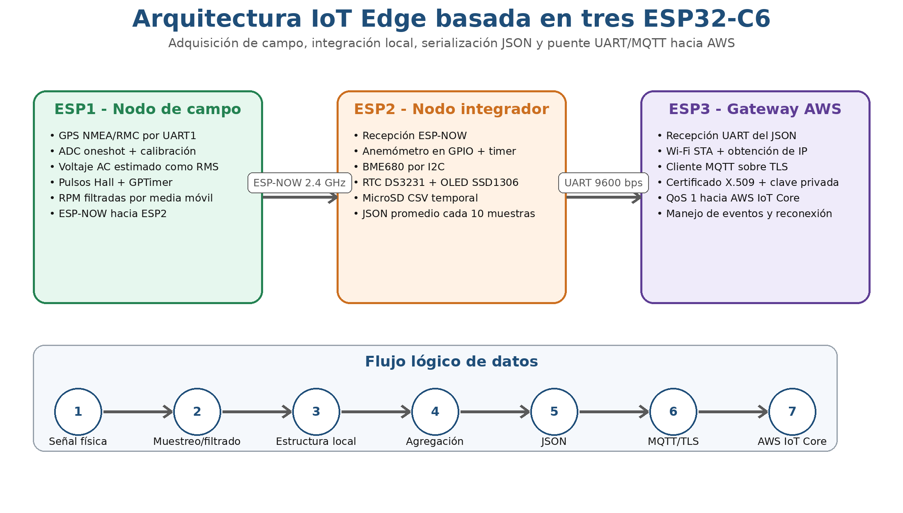

# Diseño e implementación de la arquitectura de hardware **IoT Edge**

Este capítulo desarrolla con mayor profundidad la arquitectura de hardware **IoT Edge** propuesta e implementada para el monitoreo permanente de las variables asociadas con el proceso de un generador eólico de eje vertical de pequeña escala prototipado previamente. La capa Edge, en general se entiende como el conjunto de sistemas embebidos, sensores, periféricos (**DS3231**, **SD**, Pantalla **OLED**), tareas de firmware y todos aquellos procesos que permiten convertir las señales medidas en telemetría estructurada para ser publicada en **AWS IoT Core**. En el prototipo de este trabajo, esta capa se implementa a partir de tres tarjetas **ESP32-C6** con funciones diferenciadas. ESP1 como nodo que mide variables del generador y transmite mediante **ESP-NOW**. ESP2 como nodo que mide variables ambientales, recepciona **ESP-NOW** de ESP1, estructura en **json** y serializa. Y ESP3 como nodo gateway **MQTTs** hacia **AWS IoT Core** [@nist_sp800_183; @gomez_prototipado_2024; @espressif_esp32c6_datasheet; @espressif_espnow; @rfc8259_json; @aws_iot_protocols].

La decisión de distribuir la arquitectura en tres nodos responde a un criterio de ingeniería tras surgir esta necesidad en el proceso de implementación. Inicialmente, todo se realizaba con una única ESP. Sin embargo, al llegar al límite se encontró que algunos procesos se debían separar para garantizar la funcionalidad completa de la tarjeta. Al identificar estas limitaciones, se dividió la arquitectura en los tres nodos propuestos, permitiendo un mejor balance de carga y aprovechamiento de las funciones de cada tarjeta, aislar fallas de sensórica de fallas de conectividad y mejorar la trazabilidad de toda la arquitectura [@nist_sp800_183; @espressif_freertos; @nist_ir_8228; @sisinni_industrial_iot_2018; @marjani_big_iot_2017].

{#fig-arquitectura-iot-edge width=100% fig-align="center"}

La @fig-arquitectura-iot-edge resume la arquitectura propuesta. En el nodo 1 (ESP1) se convierten señales de GPS, voltaje y RPM de la turbina en una estructura local. En el nodo 2 (ESP2) se agrega velocidad del viento, temperatura, presión, humedad, altitud, tiempo, visualización **OLED** y almacenamiento temporal en tarjeta **SD** y se transmite **json** consolidado mediante **UART**. En el nodo 3 (ESP3) se recibe el **json** por **UART**, se establece conectividad **Wi-Fi** y publica la telemetría por **MQTT** sobre **TLS** en **AWS IoT Core**. Por ende, el sistema no es únicamente una tarjeta con sensores conectados, sino un pipeline distribuido completo que garantiza desde la adquisición hasta la transmisión segura de la información recolectada [@nist_sp800_183; @gomez_prototipado_2024; @espressif_uart_driver; @aws_iot_protocols; @rfc8446].

Para orientar la lectura, la sección 3.1 explica el propósito de la capa IoT Edge y la sección 3.2 establece sus requisitos funcionales. La sección 3.3 identifica los archivos de código usados como soporte; la sección 3.4 describe la distribución física de los nodos; y la sección 3.5 relaciona sus interfaces con el modelo de capas.

Las secciones 3.6, 3.7 y 3.8 desarrollan, respectivamente, la adquisición en ESP1, la integración de datos en ESP2 y la publicación hacia AWS desde ESP3. Después se presenta el contrato de datos en 3.9, la gestión temporal en 3.10, la seguridad en 3.11 y el tratamiento de integridad y pérdida de datos en 3.12. La sección 3.13 reúne la estrategia de validación y la sección 3.14 cierra el capítulo con una síntesis.

## Propósito de la capa **IoT Edge**

La capa **IoT Edge** tiene como función principal acercar el procesamiento de los datos al punto físico donde se miden las señales. En este proyecto, las medidas nacen de la necesidad de analizar el funcionamiento de un generador eólico de eje vertical de pequeña escala, así que se miden pulsos asociados a la rotación de la turbina, voltaje generado, coordenadas geográficas, velocidad del viento, temperatura, presión atmosférica, humedad y altitud. Si estas señales se envían hacia la nube sin procesamiento, muy seguramente podría recibir datos incompletos, no se sabría a qué *timestamp* pertenece ese dato y todo sería un caos. Por ello, el Edge cumple funciones de adquisición, limpieza, filtrado, agregación, almacenamiento temporal, serialización y control básico de la integridad de los datos, lo que permite tener una arquitectura más fiable, estable y económica [@nist_sp800_183; @botta_cloud_iot_2016; @gomez_prototipado_2024; @marjani_big_iot_2017; @nist_ir_8228].

Desde la perspectiva de hardware/sensado como servicio, la capa IoT Edge no se limita a conectar sensores a tarjetas ESP32-C6. Su función es convertir mediciones físicas en datos digitales organizados, trazables y listos para ser transmitidos. Por ello, el valor de esta capa no está solo en el dispositivo, sino en su capacidad para entregar telemetría confiable al resto de la arquitectura [@nist_sp800_183; @nist_ir_8228; @espressif_esp32c6_datasheet; @espressif_freertos].

Con base en lo anterior, la capa **Edge** se encarga de definir una estructura o contrato de datos común para el sistema, de manera que las variables físicas medidas puedan convertirse en telemetría estructurada, trazable y procesable por los servicios posteriores. El voltaje se mide capturando muestras mediante **ADC**, la velocidad de la turbina se mide capturando pulsos mediante interrupciones y temporizadores precisos, la localización se obtiene desde tramas **GPS** de un módulo específico, la velocidad del viento se obtiene también mediante interrupciones y temporizadores, y las variables ambientales se obtienen mediante **I2C**. Finalmente, el mensaje se normaliza en **json**, una estructura común utilizada por los servicios de AWS, dado que las reglas IoT, las tablas, las consultas y el dashboard dependen directamente de nombres de campos estables, tipos de datos consistentes y unidades claramente documentadas [@marjani_big_iot_2017; @espressif_esp32c6_adc_calibration; @espressif_esp32c6_gptimer; @nmea_reference_manual; @espressif_i2c_driver; @aws_iot_rules].

La capa **Edge** también cumple la función de actuar como primera frontera de confiabilidad. Antes de que los datos lleguen a **AWS** se deben resolver problemas de integridad, rebote de sensores, pérdida de paquetes **ESP-NOW**, desconexión del **GPS**, errores de **UART**, fallos en el bus **I2C**, pérdida de conectividad Wi-Fi, entre otros factores. Por esta razón, el reto no consiste únicamente en leer sensores; debe incluirse temporización, gestión de tareas recurrentes, indicadores de estado del sistema, validación de estructura y registros de diagnóstico [@nist_ir_8228; @espressif_espnow; @espressif_uart_driver; @espressif_i2c_driver; @espressif_freertos; @espressif_wifi_driver_esp32c6].

## Requisitos funcionales de la arquitectura embebida

Los requisitos funcionales de la capa de hardware surgen del objetivo general del sistema, el cual consiste en medir una serie de variables físicas que permiten monitorear el funcionamiento de un generador eólico de eje vertical de pequeña escala y publicar los datos de forma trazable. Además, debe entregar estos datos al gateway en un formato compatible con **MQTT** y con la posterior ingesta en **AWS IoT Core** [@nist_sp800_183; @ref4; @gomez_prototipado_2024; @oasis_mqtt5; @aws_iot_protocols].

La tabla 3.1 presenta un resumen de los requisitos funcionales del sistema y los relaciona con el nodo responsable, mecanismos implementados y salidas esperadas. De esta manera, se establece una relación entre el requerimiento funcional y el código fuente ya que permite verificar que cada variable tenga un origen físico, un tratamiento local diferenciado y una salida normalizada. También, ayuda a identificar vacíos en la validación y trazabilidad de cada variable, lo cual es esencial porque permite que la arquitectura sea más robusta y confiable [@iso_ieee_29148_2018; @nist_sp800_183; @nist_ir_8228; @espressif_freertos].

| Requisito funcional | Nodo responsable | Mecanismo implementado | Evidencia esperada |
|---|---|---|---|
| Capturar voltaje del generador | ESP1 | ADC oneshot, calibración y cálculo RMS | Variable `voltaje_ac` en estructura ESP-NOW |
| Estimar RPM del eje | ESP1 | GPIO con interrupción y GPTimer periódico | Variable `rpm` filtrada |
| Obtener coordenadas | ESP1 | GPS por UART, sentencia RMC y conversión a decimal | `latitud`, `longitud`, `gps_fix` |
| Medir velocidad del viento | ESP2 | GPIO del anemómetro + GPTimer | `wind_speed` en json final |
| Medir variables ambientales | ESP2 | BME680 por I2C | `temperature`, `humidity`, `pressure`, `altitude` |
| Trazabilidad temporal | ESP2 | RTC DS3231 por I2C | `timestamp` en json |
| Visualización local | ESP2 | OLED SSD1306 por I2C | Pantallas rotativas de estado |
| Respaldo local | ESP2 | MicroSD por SPI/FATFS | Archivo `data.csv` |
| Publicación cloud | ESP3 | UART + Wi-Fi + MQTT/TLS | Publicación en tópico IoT | [@gomez_prototipado_2024; @ref31; @jung_wind_forecasting_2014]

: Requisitos funcionales de la arquitectura embebida IoT Edge. {#tbl-requisitos-hardware}

Adicional a los requisitos funcionales, la arquitectura debe cumplir con requisitos de operación dado que requiere ejecutar tareas concurrentes sin bloquear mediciones críticas o procesos que se estén ejecutando, mantener un canal **ESP-NOW** de baja latencia entre ESP1 y ESP2, evitar publicar datos sin la estructura **json** mínima y registrar la trazabilidad de los eventos de conectividad. Muchos de estos requisitos se fueron estructurando conforme se conocía con más profundidad las capacidades de las ESP y son coherentes con la naturaleza de **esp-idf**, para lo cual se usa FreeRTOS para organizar tareas, priorizar eventos, manejar prioridades y a  su vez,  con **MQTTs** se separa cliente, broker, tópico y calidad del servicio QoS [@iso_ieee_29148_2018; @espressif_freertos; @espressif_espnow; @oasis_mqtt5; @aws_iot_protocols; @nist_ir_8228].

## Trazabilidad del código fuente usado para el capítulo

El análisis técnico de este capítulo se soporta en tres estructuras de firmware, una para cada ESP. Las carpetas se presentan rotuladas como Firmware-ESP1, Firmware-ESP2, Firmware-ESP3. Para mantener la trazabilidad académica, la Tabla. 3.2 documenta los archivos principales generados, su función y el hash SHA-256 calculado a partir de los archivos entregados [@nist_ir_8228; @iso_ieee_29148_2018; @espressif_freertos; @nist_fips_180_4].

| Etapa | Carpeta | Archivo principal | Función técnica dominante | SHA-256 |
|---|---|---|---|---|
| ESP1 | `Firmware-ESP1` | `main.c` | GPS, ADC, RPM y ESP-NOW | `f2eb15...` |
| ESP2 | `Firmware-ESP2` | `main.c` | Integración, BME680, OLED, SD, UART y ESP-NOW | `ef4034...` |
| ESP3 | `Firmware-ESP3` | `main.c` | UART, Wi-Fi, MQTT/TLS y AWS IoT Core | `c5cccd...` |

: Trazabilidad de archivos fuente analizados para la arquitectura IoT Edge. {#tbl-trazabilidad-codigo}

Con la tabla anterior no se pretende reemplazar los anexos de código, busca que el lector conozca cuál versión del firmware se soporta en la descripción técnica. Esto es importante porque permite controlar la trazabilidad de cada etapa, lo cual es importante cuando los proyectos tienden a escalar con el tiempo. Al incluir hashes, se pretende evitar que la tesis describa una versión diferente del firmware, lo cual permite el mejoramiento de la documentación a futuro [@iso_ieee_828_2012; @iso_ieee_29148_2018; @nist_fips_180_4; @nist_ir_8228].

## Arquitectura física y asignación de responsabilidades

Como se ha planteado, la arquitectura física se distribuye en tres tarjetas **ESP32-C6**. La ESP1 se ubica espacialmente cerca al generador eléctrico y los sensores que requieren medición directa (voltaje del generador, velocidad de rotación de la turbina). La ESP2 actúa como nodo central, recibe datos de la ESP1, mide velocidad del viento y variables del sensor **BME680**, almacena en memoria **SD**, lee timestamp desde el módulo **DS3231**, visualiza en **OLED**, concentra y estructura los datos en **json** y transmite mediante **UART**. La ESP3 se dedica principalmente a la conectividad con la nube, lo que permite aislar **Wi-Fi**, certificados y **MQTTs** de las tareas de adquisición de datos [@gomez_prototipado_2024; @ref4; @espressif_freertos; @bosch_bme680_datasheet; @espressif_uart_driver; @aws_iot_protocols].

La división por funciones tiene varias ventajas prácticas que favorecen la modularidad. Por un lado, si la conexión a AWS falla, el sistema puede continuar midiendo y almacenando datos localmente para después ser enviados a la nube. Si falla **ESP-NOW**, el **json** puede reflejar un estado de desconexión y usar valores predeterminados o inferir mediante procesos para datos faltantes. Si alguno de los sensores falla, el sistema continúa operando y solo reporta la falla. Esta flexibilidad es deseable en estos sistemas IoT que operan con recursos limitados y comunicaciones que pueden ser intermitentes [@nist_sp800_183; @nist_ir_8228; @espressif_espnow; @marjani_big_iot_2017; @gomez_prototipado_2024].

La división de la arquitectura por funciones tiene varias ventajas prácticas que favorecen la modularidad. Por un lado, si la conexión a AWS falla, el sistema puede continuar midiendo y almacenando datos localmente para después ser enviados a la nube. Por otra parte, si falla **ESP-NOW**, el **json** puede reflejar un estado de desconexión y usar valores predeterminados o inferir valores mediante procesos de imputación de datos. Si alguno de los sensores falla, se reporta la anomalía y puede continuar operando normalmente. Estos sistemas flexibles son deseables en arquitecturas IoT, ya que suele operarse con recursos limitados y comunicaciones que pueden ser intermitentes [@nist_sp800_183; @nist_ir_8228; @espressif_espnow; @marjani_big_iot_2017; @sisinni_industrial_iot_2018].

| Nodo | Rol | Entradas principales | Salidas principales | Protocolos/periféricos |
|---|---|---|---|---|
| ESP1 | Nodo de campo | GPS, ADC de voltaje, pulsos Hall | Estructura binaria a ESP2 | UART, ADC, GPIO, GPTimer, ESP-NOW |
| ESP2 | Nodo integrador | ESP-NOW, anemómetro, BME680, DS3231 | CSV local, OLED, json por UART | ESP-NOW, GPIO, GPTimer, I2C, SPI, UART |
| ESP3 | Gateway cloud | json por UART | Mensaje MQTT/TLS | UART, Wi-Fi, TCP/TLS, MQTT |

: Distribución física y lógica de responsabilidades entre las tres ESP32-C6. {#tbl-roles-esp}

En la tabla 3.3 se muestra que en cada nodo se combinan diferentes periféricos. La ESP1 se enfoca en adquisición y transmisión local. La ESP2 enfatiza en integración de múltiples protocolos y periféricos. Y la ESP3 se concentra en conectividad segura con la nube. Por consiguiente, cada nodo debe probarse con criterios distintos, asegurando estabilidad para cada una de las etapas y que cada una cumpla a cabalidad los requerimientos planteados [@nist_sp800_183; @iso_ieee_29148_2018; @espressif_freertos; @espressif_uart_driver; @aws_iot_protocols].

## Modelo de capas aplicado al hardware **IoT Edge**

El sistema embebido no implementa TCP/IP en todos sus tramos. Entre sensores y microcontroladores predominan señales físicas, GPIO, ADC, **I2C**, **SPI** y **UART**; entre ESP1 y ESP2 se usa **ESP-NOW**, que funciona sobre tramas **Wi-Fi** de capa de enlace sin requerir direccionamiento IP; entre ESP2 y ESP3 se usa **UART**, que es un canal serie punto a punto; y solo entre ESP3 y AWS aparece el stack **Wi-Fi**/IP/TCP/**TLS**/**MQTT** [@espressif_i2c_driver; @espressif_uart_driver; @espressif_espnow; @rfc9293_tcp; @rfc8446; @oasis_mqtt5]

La estructura por capas presentada evita una confusión que es recurrente, y es que en IoT no todos los sensores o actuadores del sistema están directamente conectados a Internet y se pueden plantear múltiples arquitecturas y formas de establecer las comunicaciones según las necesidades del sistema. Como se evidencia en este sistema la mayoría de mediciones se desarrollan en tramos locales no IP. Internet aparece al final, cuando la ESP3 transforma el json recibido por **UART** desde la ESP2 en un mensaje **MQTT** cifrado sobre **TLS**, requerido por AWS para establecer una conexión segura. Por ejemplo, esta separación permite separar las responsabilidades de los nodos y concentrar en un único nodo la seguridad de la nube [@nist_sp800_183; @espressif_uart_driver; @oasis_mqtt5; @rfc8446; @aws_iot_protocols; @aws_iot_security_best_practices].

| Tramo | Capa física | Enlace | Red/transporte | Aplicación/datos |
|---|---|---|---|---|
| Sensores -> ESP1 | Señales analógicas, pulsos, UART GPS | GPIO/ADC/UART | No aplica | Variables físicas locales |
| ESP1 -> ESP2 | Radio 2.4 GHz | ESP-NOW/MAC | No usa IP | Estructura `mensaje_espnow_t` |
| Sensores -> ESP2 | I2C, GPIO, SPI | Buses locales | No aplica | BME680, DS3231, OLED, SD |
| ESP2 -> ESP3 | UART 9600 bps | Serial punto a punto | No usa IP | json terminado en `\n` |
| ESP3 -> AWS | Wi-Fi 802.11 | IP/TCP/TLS | MQTT sobre TLS | Publicación en tópico IoT |

: Modelo por capas aplicado a los tramos del sistema IoT Edge. {#tbl-capas-edge}

La tabla 3.4 permite evidenciar la necesidad de implementar controles de seguridad por tramo, ya que en cada nodo se manejan protocolos diferentes y los riesgos varían notablemente. En el tramo 1 (ESP1-ESP2), es necesario proteger **ESP-NOW** a nivel de par y clave, además de proteger las MACs y tener estrategias contra la suplantación de estas. Por otra parte, en el nodo dos deben controlarse las distancias y el manejo del bus **I2C**, además, en **UART** debe controlarse el tamaño de la trama, establecer delimitadores y validación de la estructura. En el nodo tres, **MQTTs** debe protegerse mediante certificados **X.509** otorgados por AWS, políticas IoT y sincronización de tiempo (SNTP). Como se aprecia, cada protocolo suele tener sus propios controles diseñados para riesgos identificados y esto hace que cada vez la seguridad sea algo más necesario y articulado [@nist_ir_8228; @espressif_espnow; @espressif_i2c_driver; @espressif_uart_driver; @aws_iot_x509; @aws_iot_policies].

## ESP1: nodo de adquisición de campo

La ESP1 cumple el rol de nodo de adquisición a nivel del generador. En el archivo Firmware-ESP1/main/main.c se observa una estructura basada en tres tareas principales gps_task, voltage_task y espnow_task, acompañadas por una interrupción GPIO para pulsos y un GPTimer para cálculo periódico de RPM. La estructura compartida mensaje_t contiene latitud, longitud, voltaje_ac, rpm y gps_fix, que son las variables enviadas hacia ESP2 [@espressif_freertos; @espressif_esp32c6_gpio; @espressif_esp32c6_gptimer; @espressif_esp32c6_adc_calibration; @nmea_reference_manual; @espressif_espnow].

En la tabla 3.5 se presenta la asignación de pines y periféricos utilizados. El **GPS** (módulo NEO-6M) se usa UART_NUM_1 con RX en GPIO20 y TX en GPIO21, el voltaje usa ADC_CHANNEL_0 y se toman decenas o cientos de muestras por segundo, el sensor de pulsos se conecta al GPIO22 y el LED de estado al GPIO2. La comunicación **ESP-NOW** se soporta en las direcciones MAC de cada ESP, en este caso, apunta hacia la dirección **MAC** de la ESP-2 **40:4C:CA:42:13:00**, mientras se configura el canal **Wi-Fi** en “1” para mantener la coherencia con el receptor [@nmea_reference_manual; @espressif_uart_driver; @espressif_esp32c6_adc_calibration; @espressif_esp32c6_gpio; @espressif_espnow; @iso_ieee_8802_11_2018].

| Elemento | Configuración en ESP1 | Función |
|---|---|---|
| UART GPS | `UART_NUM_1`, RX GPIO20, TX GPIO21, 9600 bps | Lectura de tramas NMEA/RMC |
| ADC voltaje | `ADC_CHANNEL_0`, 12 bits, atenuación 12 dB | Lectura de señal acondicionada |
| Sensor Hall | GPIO22, interrupción por flanco negativo | Conteo de pulsos del eje |
| LED estado | GPIO2 | Indicación visual de envío |
| GPTimer | Resolución de 1 MHz, alarma cada 1 s | Cálculo periódico de RPM |
| ESP-NOW | Canal 1, peer MAC ESP2 | Envío de `mensaje_t` |

: Configuración de hardware identificada en ESP1. {#tbl-esp1-pines}

### Adquisición **GPS** en ESP1

En este proyecto se añade un módulo **GPS**, el cual permite principalmente monitorear la ubicación del dispositivo y se pueden extraer datos adicionales. Este proceso se soporta en el módulo comercial NEO-6M y en la librería minmea.h. La adquisición se implementa mediante la tarea en FreeRTOS gps_task, con prioridad adecuada y que instala el driver **UART**, configura velocidad de 9600 bps y reconstruye líneas NMEA hasta encontrar saltos de línea. El firmware filtra sentencias RMC mediante minmea_sentence_id y extrae latitud, longitud y estado de validez con minmea_parse_rmc. La sentencia RMC es adecuada porque contiene información mínima recomendada de posición, tiempo, fecha, curso y velocidad, y la transmisión NMEA se basa en mensajes ASCII delimitados por caracteres especiales [@nmea_reference_manual; @espressif_uart_driver; @espressif_freertos; @nist_ir_8228].

Dado que los sistemas de almacenamiento, visualización y análisis geográfico suelen consumir coordenadas en grados decimales y no en formato ddmm.mmmm o dddmm.mmmm, se hace necesario un proceso de transformación de coordenadas. En este firmware, se hace mediante la función convertir_a_decimal, que transforma el formato NMEA de grados y minutos en grados decimales. Si la dirección es sur o oeste, el código cambia el signo de la coordenada [@nmea_reference_manual; @rfc7946_geojson].

Matemáticamente, la conversión usada por el firmware puede expresarse como:

$$
\theta_{\mathrm{dec}} = \left\lfloor \frac{\theta_{\mathrm{nmea}}}{100}\right\rfloor + \frac{\theta_{\mathrm{nmea}} - 100\left\lfloor \theta_{\mathrm{nmea}}/100\right\rfloor}{60}.
$$ 

Donde,

$\theta_{\mathrm{nmea}}$ representa la latitud o longitud codificada en grados y minutos,

$\theta_{\mathrm{dec}}$ representa la coordenada en grados decimales. El signo final depende del hemisferio reportado por el receptor **GPS**: norte y este se toman como positivos; sur y oeste se toman como negativos

Esta transformación debe documentarse porque cualquier error de signo produciría una ubicación geográfica incorrecta en la base histórica [@nmea_reference_manual; @rfc7946_geojson; @nist_ir_8228].

### Medición de voltaje en ESP1

La medición de voltaje se implementa mediante la tarea de FreeRTOS voltage_task mediante el driver ADC oneshot y el esquema de calibración adc_cali_create_scheme_curve_fitting. En este proceso se configura el canal a 12 bits, atenuación de 12 dB, se toman 200 muestras por segundo, se elimina un offset de 1.65 V asociado al acondicionamiento del voltaje a medir y ce una estimación del voltaje RMS a partir de las muestras válidas y la aplicación de una media móvil de los últimos cinco  valores para tratar con outliers instantáneos. El uso de calibración ADC es importante porque la conversión directa de conteos crudos a voltaje puede introducir error si no se consideran características internas del chip [@espressif_freertos; @espressif_esp32c6_adc_calibration; @gomez_prototipado_2024; @nist_ir_8228].

El cálculo RMS aplicado por la ESP1 se puede representar como:

$$
V_{\mathrm{rms}} = K \sqrt{\frac{1}{N_v}\sum_{i=1}^{N_v} \left(v_i - V_{\mathrm{off}}\right)^2},
$$

donde, 

$V_{\mathrm{off}}$ es el offset del circuito de acondicionamiento,

$N_v$ es el número de muestras válidas,

$K$ representa el factor de escala del divisor o acondicionador 

En el código, offset = 1.65f, num_muestras = 200 y voltage_divider_ratio = 2.0f; por tanto, debe tenerse presente el circuito real de acondicionamiento y el procedimiento experimental usado para ajustar K.

La etapa de medición de voltaje tiene un punto crítico, y es que se está midiendo voltaje sinusoidal de muy pequeña amplitud (~300 mV). Para medir voltaje tan pequeños, se optó por una metodología en la cual se desplaza la señal negativa de la onda hacia cero (0) mediante un offset continuo, se mide la señal desplazada pero positiva y después se le resta el valor del offset mediante código. Esto puede variar, y existen muchos otros métodos para medir tanto voltaje CC como AC. En este caso, no se alcanza a generar una señal lo suficientemente grande para hacer rectificación a CC y así medir una señal más estable, por lo que se advierte que el proceso de instrumentación y medición de variables eléctricas, en este caso voltaje, debe adaptarse a las necesidades de cada dispositivo [@espressif_esp32c6_adc_calibration; @gomez_prototipado_2024; @kester_data_conversion_2005; @nist_ir_8228].

#### Acondicionamiento de señal para medición de voltaje AC

La medición del voltaje del generador no puede conectarse directamente al ADC de la **ESP32-C6**. El ADC admite un rango limitado de voltaje y requiere que la señal esté referida a tierra del circuito de medición. Por lo tanto, el diseño debe cumplir tres condiciones: 1) reducir la amplitud mediante un divisor resistivo, 2) desplazar la señal alterna hacia un punto medio seguro (0 V) cuando se requiera capturar semiciclos positivos y negativos como en este caso, y 3) proteger la entrada frente a sobretensiones o transitorios (etapa que no se implementa a profundidad en este proyecto). Esto se explica en el circuito de referencia mostrado en la tesis de maestría sobre el prototipado y análisis comparativo de dos turbinas eólicas de eje vertical [@gomez_prototipado_2024], en el que un primer divisor reduce la amplitud de la señal del generador y un segundo divisor crea una referencia intermedia para que la onda pueda ser leída por el conversor analógico–digital [@espressif_esp32c6_adc_calibration; @kester_data_conversion_2005; @nist_ir_8228].

El divisor resistivo se puede expresar de forma general como:

$$
V_{\mathrm{adc}} = V_{\mathrm{in}} \frac{R_2}{R_1+R_2}.
$$
Si R1=R2, la señal aplicada al ADC corresponde aproximadamente a la mitad de la señal de entrada (señal de salida del generador). Esta relación es útil, pero se debe tener presente que esa premisa solo se cumple en escenarios ideales, en la realidad, depende de la tolerancia de las resistencias, dinámica del sistema, respuesta del generador en el tiempo, de la temperatura, entre otros factores. Por lo tanto, es importante acercarse mediante la validación experimental y debido a eso en el firmware se incorpora un factor voltage_divider_ratio y una calibración ADC para convertir la lectura digital en una estimación física de voltaje [@espressif_esp32c6_adc_calibration; @kester_data_conversion_2005; @gomez_prototipado_2024; @nist_ir_8228].

### Estimación de RPM en ESP1

La estimación de la velocidad de giro de la turbina se hace calculando las revoluciones por minuto (RPM). Para esto, se acopla un sensor de efecto Hall o Reed Switch en la base del generador cerca al eje, de manera que detecte la energía de un imán cada vez que da una vuelta. Este sensor se conecta al GPIO22 y los pulsos se miden mediante la interrupción sensor_isr_handler, la cual incrementa contador_pulsos cuando detecta un flanco negativo y aplica un debounce (retardo) de 10 ms usando esp_timer_get_time. El uso de interrupciones es importante porque permite contar eventos rápidos sin esperar a que una tarea periódica consulte el pin, pero exige cuidado en la duración de la rutina ISR y en el uso de variables volatile [@espressif_esp32c6_gpio; @espressif_esp32c6_gptimer; @espressif_freertos; @gomez_prototipado_2024; @ref35].

El cálculo periódico se ejecuta cada segundo a través de GPTimer en timer_callback. En el código se define PULSOS_POR_REVOLUCION = 2 y ESCALA_RPM = 60/(INTERVALO_SEGUNDOS * PULSOS_POR_REVOLUCION). Con una ventana de un segundo, cada pulso representa treinta RPM cuando se tienen dos pulsos por vuelta. El código filtra valores mayores a 500 RPM ya que el límite de rotación de la turbina está por debajo de ese umbral, y aplica una media móvil de tres muestras para reducir variaciones bruscas [@espressif_esp32c6_gptimer; @espressif_esp32c6_gpio; @espressif_freertos; @gomez_prototipado_2024; @ref35].

La ecuación general de RPM implementada es: [@espressif_esp32c6_gptimer; @espressif_esp32c6_gpio]

$$
RPM = \frac{N_p}{N_{\mathrm{ppv}}}\cdot\frac{60}{\Delta t},
$$


donde,

$N_p$ es el número de pulsos contados en la ventana,

$N_{\mathrm{ppv}}$ es el número de pulsos por vuelta y,

$\Delta t$ es la duración de la ventana en segundos

En esta implementación, $N_{\mathrm{ppv}}=2$ y $\Delta t=1$, por lo que $RPM=30N_p$.

### Envío **ESP-NOW** desde ESP1

La tarea de FreeRTOS espnow_task envía cada un segundo la estructura mensaje_t hacia la ESP2. El envío usa esp_now_send y registra en consola voltaje, RPM, estado **GPS** y coordenadas y activa un LED durante 200 ms como confirmación visual. Sin embargo, debe tenerse en cuenta de que esta es únicamente una confirmación visual de que el paquete de datos se envió, no de que se recibió en ESP2 [@espressif_freertos; @espressif_espnow; @nmea_reference_manual; @espressif_esp32c6_gpio; @nist_ir_8228].

En el código de ESP1, el peer **ESP-NOW** se configura con `.encrypt = true`. Esto significa que en este proyecto la comunicación local ESP1-ESP2 cifra los datos que se transmiten a través del protocolo. Para una arquitectura sólida, ESP1 y ESP2 deben usar PMK/LMK coherentes y activar cifrado por peer [@espressif_espnow; @nist_ir_8228].

## ESP2: nodo integrador, almacenamiento local y serialización **json**

El nodo 2 (ESP2) es el más complejo de la arquitectura Edge presentada. Su firmware se encuentra en Firmware-ESP2/main/main.c. En este nodo se integran: 1) recepción **ESP-NOW** de la información enviada por ESP-1, 2) conteo de pulsos del anemómetro con la misma lógica con la que se determina la velocidad de la turbina en ESP-1, 3) coordinación del bus **I2C** para la lectura del **BME680**, del **DS3231** y la escritura en la pantalla **OLED** SSD1306, 4) Manejo de memoria SD a través de **SPI**, construcción de promedios y envío de los datos en estructura **json** por **UART** a la ESP3 [@espressif_espnow; @espressif_i2c_driver; @bosch_bme680_datasheet; @espressif_freertos; @espressif_uart_driver; @nist_ir_8228].

Se podría pensar que la función de la ESP2 es convertir múltiples fuentes de datos (sensores-hardware) en un mensaje coherente que pueda ser interpretado por el usuario. En el código, para la recepción por **ESP-NOW** mensaje_espnow_t replica la estructura esperada desde ESP1: latitud, longitud, voltaje_ac, rpm y gps_fix. Además, ESP2 genera velocidad_viento a partir de pulsos locales obtenidos mediante interrupción ISR y GPTimer, lee ambiente mediante **BME680**, calcula altitud a partir de la presión atmosférica, toma timestamp del **DS3231** y calcula uso de memoria con esp_get_free_heap_size. La salida final se produce como un **json** de 512 bytes enviado por **UART** a la ESP3 [@espressif_espnow; @espressif_esp32c6_gpio; @espressif_esp32c6_gptimer; @bosch_bme680_datasheet; @espressif_uart_driver; @nist_ir_8228].

| Subsistema ESP2 | Componente | Configuración identificada | Función |
|---|---|---|---|
| Anemómetro | GPIO7 | Interrupción + GPTimer 1 s | Velocidad de viento |
| I2C | SDA GPIO5, SCL GPIO6 | `I2C_NUM_0`, 400 kHz en dispositivos | BME680, OLED, DS3231 |
| OLED | SSD1306, dirección 0x3C | 128x64 | Visualización local |
| Ambiental | BME680, dirección 0x77 | Temperatura, humedad, presión | Variables de entorno |
| Tiempo | DS3231, dirección 0x68 | Registros BCD | Timestamp local |
| MicroSD | SPI, MOSI 23, MISO 22, SCLK 21, CS 3 | FATFS, `data.csv` | Respaldo y promedios |
| UART salida | UART1, TX GPIO15, RX GPIO9 | 9600 bps | json hacia ESP3 |
| ESP-NOW | Peer ESP1 | Canal 1 | Datos remotos |

: Subsistemas integrados en ESP2 según el firmware activo. {#tbl-esp2-subsistemas}

### Recepción **ESP-NOW** en ESP2

La recepción **ESP-NOW** se implementa mediante las funciones inicializar_espnow_receptor y on_receive_espnow. El receptor (ESP2) inicializa **ESP-NOW**, configura una PMK, registra la MAC de ESP1 como peer y asigna el callback de recepción. Cuando llega un paquete con tamaño igual a sizeof(mensaje_espnow_t), se copia la estructura, se actualizan voltaje, RPM, coordenadas y timestamp de última recepción. Dado que se conoce la estructura de datos enviada por el emisor, se programa la recepción de forma tal que los datos de entrada se puedan copiar fácilmente, esto reduce procesamiento al momento del “parsing” porque ambas ESP comparten una estructura de datos común [@espressif_espnow; @nist_ir_8228; @marjani_big_iot_2017].

Para determinar si ESP1 está conectado, la ESP2 está constantemente comparando el tiempo actual con ultima_recepcion_espnow. Si la diferencia supera tres segundos (tiempo modificable), el **json** usa valores sentinela (banderas) preestablecidos como -1.0 para voltaje y RPM. Este mecanismo es importante porque disminuye la pérdida de información ya que evita confundir “cero medido” con “dato no disponible”. En sistemas de monitoreo esto es muy importante porque permite diferenciar valor físico cero (por ejemplo: el anemómetro no está rotando porque no hay viento), pérdida de sensor (el anemómetro fue destrozado por un fuerte viento) y pérdida de comunicación (se perdió la conexión con Internet y no se volvió a conectar). Esto es fundamental para la calidad del dato y para que quien monitorea tenga claridad sobre el fenómeno [@espressif_espnow; @nist_ir_8228; @marjani_big_iot_2017; @sisinni_industrial_iot_2018; @ref35].

### Medición de velocidad del viento en ESP2

La velocidad de viento se calcula en ESP2 mediante un anemómetro conectado al GPIO7. La interrupción incrementa contador_pulsos y el GPTimer calcula velocidad_viento = contador_pulsos * ESCALA_VELOCIDAD cada segundo, tal cual como se hizo con la velocidad de la turbina en ESP1. En el código, ESCALA_VELOCIDAD = 0.47f; por tanto, cada pulso por segundo equivale a 0.47 m/s según el ajuste experimental definido. Este valor corresponde al perímetro que recorre un alabe del anemómetro en una vuelta, por ende, el número de vueltas por segundo por ese perímetro corresponde a la distancia aproximada recorrida por el fluido [@espressif_esp32c6_gpio; @espressif_esp32c6_gptimer; @gomez_prototipado_2024; @ref4; @ref35].

La ecuación implementada puede escribirse como:

$$
v = K_a \cdot N_p,
$$


donde,

$v$ es la velocidad estimada del viento en m/s,

$K_a$ es el factor de calibración del anemómetro (perímetro) y,

$N_p$ es el número de pulsos por ventana de un segundo.

### Bus **I2C** compartido: **BME680**, **OLED** y **DS3231**

La tarjeta **ESP32-C6** es una actualización muy poderosa de la ESP32 WRoom, sin embargo, aunque soporta más protocolos también recorta en otros. Por ejemplo, en **UART** cuenta con UART0 (predestinado para programar la tarjeta), UART1 (se aprovecha en ESP1 con **GPS** y en ESP2 para transmitir a ESP3). En **I2C**, esta tarjeta cuenta con un bus en el sistema principal y otro en el sistema de baja potencia LP **I2C**. En la ESP2, se usa este bus maestro en GPIO5 y GPIO6 y se encarga de atender y coordinar la comunicación con el sensor **BME680**, el cual provee datos de temperatura, presión atmosférica, humedad; del reloj RTC **DS3231** y escribe en la pantalla **OLED** SSD1306. Como varios dispositivos utilizan el mismo medio al tiempo para enviar y recibir datos (bus físico - 2 cables), se usó la funcionalidad de FreeRTOS i2c_mutex para proteger operaciones críticas y evitar las colisiones lógicas entre tareas ya que existían [@espressif_esp32c6_datasheet; @espressif_uart_driver; @espressif_i2c_driver; @bosch_bme680_datasheet; @espressif_freertos; @nist_ir_8228].

El **BME680** se inicializa en la dirección 0x77 (hexadecimal), configura oversampling, filtro IIR, heater profile y duración de medición. Bosch define el **BME680** como un sensor digital 4 en 1 capaz de medir gas, humedad, presión y temperatura, aunque en este proyecto se usan principalmente temperatura, humedad y presión para caracterizar la potencia eólica que recibe la turbina, pues estas variables se relacionan a través de la densidad del aire como se muestra en la tesis de maestría sobre el prototipado y análisis comparativo de dos turbinas eólicas de eje vertical [@gomez_prototipado_2024]. La altitud se deriva a partir de presión mediante una ecuación barométrica aproximada [@bosch_bme680_datasheet; @espressif_i2c_driver; @ref4].
 
La ecuación de altitud usada en el firmware es:

$$
h = 44330\left(1 - \left(\frac{P}{P_0}\right)^{0.1903}\right),
$$


donde, 

$P$ es la presión medida o corregida y, 

$P_0$ corresponde a la presión de referencia al nivel del mar o una presión base ajustada. 

En el código se observa SEA_LEVEL_PRESSURE_HPA = 1202.5f y ajustes empíricos sobre presión, temperatura y humedad. Estos ajustes deben corresponder a validaciones experimentales, lo cual es importante a la hora de adaptar el sistema en otros entornos.

El RTC **DS3231** es un módulo electrónico que se comunica mediante I2c y tiene la capacidad de brindar fecha y hora en tiempo real para construir la variable de timestamp y poder interrelacionar todas las variables del sistema en función del tiempo. Por otra parte, la pantalla **OLED** permite mostrar datos operativos sin depender de un computador o una pantalla más costosa, también se comunica a través de **I2C**. El uso de visualización local es bastante útil porque permite verificar rápidamente si existe señal de viento, voltaje, RPM, memoria, temperatura o presión y determinar posibles fallas o conocer los valores actuales del sistema sin ver el dashboard. Sin embargo, como **OLED**, **BME680** y **DS3231** comparten **I2C**, si existe una falla de bus, se pueden afectar varias funciones a la vez [@analog_ds3231_datasheet; @solomon_ssd1306_datasheet; @espressif_i2c_driver; @bosch_bme680_datasheet; @nist_ir_8228].

### Almacenamiento local en microSD

El firmware programado para la ESP2 también monta sobre **SPI** y **FATFS** almacenamiento local a través de una tarjeta micro **SD** de 2 GB y usando esp_vfs_fat_sdspi_mount. Se crea un archivo llamado data.csv con encabezado y registra timestamp, velocidad de viento, voltaje, temperatura, humedad, presión, altitud, latitud, longitud, estado **ESP-NOW**, uso de memoria y RPM de la turbina. Esta capa se usa en este caso para almacenar 10 muestras y así enviar una muestra completa cada 10 segundos a AWS a partir del promedio de las variables continuas. También, es importante implementar un sistema de almacenamiento que actúe cuando no hay conexión hacia (AWS - ESP3) con el propósito de no perder datos en medio de esas contingencias [@espressif_sdspi_host_esp32c6; @espressif_espnow; @nist_ir_8228; @marjani_big_iot_2017; @gomez_prototipado_2024].

A partir de la función sd_write_sample se escriben muestras individuales en el archivo data.csv y se acumulan las variables en una estructura relacional para promediarlas cada diez muestras o cada 10 segundos, o sea, ya no son variables separadas. Al alcanzar diez muestras, data_task calcula los promedios para cada variable y construye el **json** que se envía por **UART** a la ESP3. Esta estructura se define principalmente para reducir tráfico hacia AWS, minimizar costos y suavizar ruido de los sensores [@espressif_sdspi_host_esp32c6; @espressif_uart_driver; @marjani_big_iot_2017; @nist_ir_8228; @aws_iot_protocols].

### Generación del **json** en ESP2

El **json** consolidado se genera en data_task con snprintf dentro de un buffer de 512 bytes. Los campos observados son timestamp, wind_speed, voltage, temperature, humidity, pressure, altitude, lat, lon, rpm, esp_now_connected y memory_usage. Este contrato debe mantenerse estable porque **AWS IoT Core**, las reglas IoT, **DynamoDB**, **S3**, **Athena** y el dashboard dependen de los nombres y tipos de esos campos [@oasis_mqtt5; @aws_iot_protocols; @aws_iot_rules; @aws_dynamodb_core_components; @aws_s3_prefixes; @aws_athena_glue_catalog].

```json
{
  "timestamp": "18/05/26 12:30:00",
  "wind_speed": 2.35,
  "voltage": 1.42,
  "temperature": 24.80,
  "humidity": 63.20,
  "pressure": 1012.45,
  "altitude": 1280.50,
  "lat": 4.823465,
  "lon": -75.724832,
  "rpm": 120.0,
  "esp_now_connected": true,
  "memory_usage": 18.40
}
```

### Envío **UART** de ESP2 hacia ESP3

Una vez generado y alistado el **json**, la ESP2 lo envía a la ESP3 por **UART** mediante uart_write_bytes. En el programa se configura UART1 a 9600 bps (bits per second o baudios) con TX en GPIO15 y RX en GPIO9 para esta tarea. UART0 por defecto se deja para programar la tarjeta. Por facilidad, el **json** se termina con salto de línea, lo que permite que el receptor identifique mensajes completos. **UART** es apropiado para este tramo porque ESP2 y ESP3 son nodos físicos cercanos, conectados punto a punto y sin necesidad de direccionamiento IP [@espressif_uart_driver; @rfc8259_json; @nist_sp800_183; @nist_ir_8228].

Aunque es relativamente sencillo con respecto a otros protocolos, una implementación completa de **UART** requiere controles explícitos de robustez. En ese contexto, el receptor debe tener la capacidad de manejar tramas incompletas, buffers con capacidad insuficiente, mensajes concatenados, caracteres dañados o corruptos, entre otros retos. En este proyecto, la ESP3 reconstruye el **json** enviado desde la ESP2 a partir de la búsqueda de llaves preestablecidas de apertura y cierre de la trama. La estrategia planteada es efectiva, sin embargo, puede mejorarse usando delimitadores explícitos como longitud de trama, checksum o CRC para garantizar la integridad y completitud del mensaje [@espressif_uart_driver; @rfc8259_json; @nist_ir_8228; @koopman_crc_2004].

### Tareas concurrentes en ESP2

Como se ha evidenciado, en la ESP2 se utilizan múltiples (5) tareas **FreeRTOS**: monitoreo de memoria, adquisición/integración de datos, visualización **OLED**, recepción **UART** de diagnóstico y watchdog del **BME680**, cada una con su prioridad correspondiente. Además, usa interrupciones para conteo de pulsos, GPTimer, callback **ESP-NOW** para recepción, tres  periféricos con **I2C** y uno (1) con **SPI**. Esta combinación de tareas, callbacks e interrupciones permite responder a eventos de diferente naturaleza, pero exige coordinación mediante mutex y cuidado en el acceso a variables compartidas [@espressif_freertos; @espressif_uart_driver; @bosch_bme680_datasheet; @espressif_espnow; @espressif_i2c_driver; @espressif_sdspi_host_esp32c6].

| Tarea o callback | Prioridad asignada | Función | Recurso crítico |
|---|---:|---|---|
| `uart_receive_task` | 5 | Diagnóstico UART | UART1 |
| `monitor_memoria_task` | 4 | Monitoreo de heap | Memoria global |
| `data_task` | 3 | Lectura, agregación, SD y json | I2C, SD, UART |
| `bme_watchdog_task` | 3 | Supervisión del BME680 | I2C/BME680 |
| `display_task` | 2 | Pantallas OLED | I2C/OLED |
| `on_receive_espnow` | callback | Actualización remota | Variables ESP-NOW |
| `timer_callback` | ISR/callback | Cálculo velocidad viento | Contador de pulsos |

: Tareas concurrentes identificadas en ESP2. {#tbl-tareas-esp2}

La tabla 3.7 muestra que la tarea data_task concentra la mayor responsabilidad funcional. Esta tarea lee el RTC, solicita mediciones al **BME680**, escribe en la SD, calcula promedios y memoria, construye el **json** y lo transmite por **UART**, lo que termina sobrecargando mucho la función. Aunque es plenamente funcional, desde el punto de vista de robustez, una mejora futura sería desacoplar almacenamiento SD, construcción **json** y transmisión **UART** mediante colas **FreeRTOS**, de forma que una escritura lenta en **SD** no retrase el envío de datos [@espressif_freertos; @bosch_bme680_datasheet; @espressif_sdspi_host_esp32c6; @rfc8259_json; @espressif_uart_driver; @nist_ir_8228].

## ESP3: gateway **UART**, **Wi-Fi** y **MQTT**/**TLS** hacia **AWS IoT Core**

La ESP3 actúa como la frontera entre la arquitectura embebida local (ESP1–ESP2–ESP3) y AWS. Para esta etapa, el firmware corresponde a Firmware-ESP3/main/main.c. La función de ESP3 es recibir el **json** enviado por ESP2 mediante **UART**, verificar la estructura mínima, conectarse a **Wi-Fi** como estación, iniciar el cliente **MQTT** sobre **TLS**, autenticarse con certificado **X.509** y publicar la telemetría en el tópico configurado en **AWS IoT Core**. Esta separación hace que ESP1 y ESP2 no tengan que gestionar certificados ni sesiones **TLS** ya que es relativamente complejo, lo cual podría analizarse como una ventaja de la arquitectura planteada [@rfc8259_json; @espressif_uart_driver; @oasis_mqtt5; @rfc8446; @aws_iot_protocols; @aws_iot_x509].

En el firmware se configura UART1 a 9600 baudios con TX en GPIO15 y RX en GPIO22 para interconectarse con la ESP2. La tarea uart_receive_task lee bytes periódicamente y reconstruye mensajes entre { y }, valida que exista la estructura mínima de llaves y publica el contenido en el tópico si mqtt_connected es verdadero, es decir, si se logró conectar a AWS. Este enfoque ayuda a mejorar la tolerancia frente a la fragmentación básica del flujo serial y evita la publicación de strings que no sean **json** en la estructura predeterminada, esto facilita la limpieza e interpretación de la data [@espressif_uart_driver; @rfc8259_json; @oasis_mqtt5; @aws_iot_protocols; @nist_ir_8228].

| Elemento ESP3 | Configuración identificada | Función |
|---|---|---|
| UART | `UART_NUM_1`, 9600 bps, TX GPIO15, RX GPIO22 | Recepción del json desde ESP2 |
| Wi-Fi | Modo estación, WPA2-PSK | Conexión IP local |
| MQTT | Host AWS IoT, puerto 8883, QoS 1 | Publicación cloud |
| TLS | Transporte SSL/TLS | Cifrado e integridad |
| Identidad | `client_id = ESP32C6-AWS` | Identificación del dispositivo |
| Certificados | Certificado de dispositivo y llave privada embebidos | Autenticación X.509 |
| Mutex | `mqtt_mutex` | Protección del cliente MQTT |

: Configuración funcional del gateway ESP3. {#tbl-esp3-config}

### Conectividad **Wi-Fi** en ESP3

La conexión a **Wi-Fi** se implementa mediante la función wifi_init_sta, la cual crea la interfaz STA, registra manejadores de eventos, configura SSID y contraseña de la red de Internet, inicia el driver y espera la obtención de IP. El manejador de eventos actualiza la bandera wifi_connected cuando se recibe IP_EVENT_STA_GOT_IP y reconecta en caso de desconexión. Este patrón es habitual en **esp-idf** porque **Wi-Fi** se maneja mediante eventos asíncronos [@espressif_wifi_driver_esp32c6; @espressif_event_loop_esp32c6; @espressif_freertos; @nist_ir_8228].

En un proyecto real, ningún tipo de credencial debe compartirse, por el contrario, deben gestionarse con buenas prácticas de seguridad y embeberse en firmware para evitar exposiciones de seguridad. Prácticas más seguras sugieren usar configuraciones externas, particiones NVS cifradas, aprovisionamiento controlado o variables no versionadas [@nist_ir_8228; @aws_iot_security_best_practices; @aws_iot_x509; @espressif_nvs_encryption_esp32c6; @espressif_unified_provisioning_esp32c6].

### **MQTT** sobre **TLS** y certificados **X.509**

La conexión **MQTT** (Message Queuing Telemetry Transport) se configura con la función esp_mqtt_client_config_t. El broker usa el endpoint de **AWS IoT Core**, el puerto estándar y oficial para conexiones **MQTTs** 8883 y transporte MQTT_TRANSPORT_OVER_SSL. La identidad del dispositivo se precisa mediante client_id y la autenticación usa certificado de dispositivo y llave privada creados en **AWS IoT Core** embebidos en el firmware. A su vez, este servicio usa certificados **X.509** para autenticar dispositivos antes de permitir comunicación, y **TLS** protege la confidencialidad e integridad contra escucha, alteración y falsificación de los datos [@espressif_mqtt_client_esp32c6; @oasis_mqtt5; @aws_iot_protocols; @aws_iot_x509].

El evento MQTT_EVENT_CONNECTED indica la conexión marcando la bandera mqtt_connected = true y registra el endpoint otorgado por AWS, client ID y el tópico. El evento MQTT_EVENT_PUBLISHED confirma la publicación de la telemetría en el tópico y MQTT_EVENT_ERROR permite diagnosticar fallas de transporte o handshake **TLS**. Esta estructuración por eventos es bastante importante porque en sistemas IoT no solo se trata de llamar una función de publicación; se debe confirmar el estado real del cliente, registrar causas de error y garantizar la trazabilidad completa ya que se trata de sistemas que tienen una alta interacción con la red de Internet [@espressif_mqtt_client_esp32c6; @oasis_mqtt5; @aws_iot_protocols; @nist_ir_8228].

### Recepción y validación **json** en ESP3

La función verify_and_format_json revisa que el mensaje recibido mediante **UART** contenga llaves de apertura y cierre, extrae el contenido entre la primera { y la última }, verifica que el tamaño no exceda el tamaño del buffer definido y produce una cadena lista para publicar a partir de la estructura preestablecida. Esta validación es mínima, pero evita enviar al broker fragmentos **UART** sin estructura y conservar la homogeneidad e integridad en la base de datos [@espressif_uart_driver; @rfc8259_json; @oasis_mqtt5; @aws_iot_protocols; @nist_ir_8228].

El uso de QoS 1 (Quality of Service nivel 1) en esp_mqtt_client_publish indica que desde el cliente se solicita confirmación de entrega al broker al menos una vez. Esto mejora confiabilidad frente a QoS 0, aunque puede permitir duplicados si ocurre retransmisión, situación que debe contemplarse en el procesamiento. En una arquitectura de datos histórica, los duplicados deben manejarse con timestamp, clientId e identificadores de mensaje para evitar registros repetidos o inconsistencias en series temporales [@espressif_mqtt_client_esp32c6; @oasis_mqtt5; @aws_iot_protocols; @marjani_big_iot_2017; @nist_ir_8228].

## Contrato de datos Edge--Cloud

El contrato de datos es el elemento que une el hardware, firmware y la nube. Si los nombres de campos cambian entre ESP2, AWS IoT Rule, **DynamoDB**, **Athena** y frontend, la arquitectura completa se rompe aunque la comunicación **MQTT** funcione bien. Por esta razón, el contrato debe definirse como una especificación estándar del sistema y no como una salida cualquiera del snprintf usado en el firmware, todo está interconectado en este caso [@iso_ieee_29148_2018; @rfc8259_json; @aws_iot_rules; @aws_dynamodb_core_components; @aws_athena_glue_catalog; @nist_ir_8228].

En la tabla 3.9 se presenta una propuesta de estructura para el contrato de datos. Se recomienda mantener los nombres en inglés para compatibilidad con código y servicios de AWS, pero documentar en español su significado, unidad, tratamiento de errores y presentación. También, se recomienda incluir clientId para nombrar los sistemas de forma explícita en el **json** generado por ESP2 o agregado por ESP3 antes de publicar, porque **DynamoDB** y **Athena** usan este campo llave e consulta en el caso de tener múltiples sistemas reportando datos [@iso_ieee_29148_2018; @rfc8259_json; @aws_iot_rules; @aws_dynamodb_core_components; @aws_athena_glue_catalog; @nist_ir_8228].

| Campo | Tipo | Unidad | Origen | Tratamiento recomendado |
|---|---|---|---|---|
| `clientId` | string | No aplica | ESP3 o configuración | Obligatorio |
| `timestamp` | string | Fecha/hora local | DS3231/ESP2 | Obligatorio; formato estable |
| `wind_speed` | number | m/s | ESP2/anemómetro | Rango físico y calibración |
| `voltage` | number | V | ESP1/ADC | `-1.0` si no hay ESP-NOW |
| `temperature` | number | °C | ESP2/BME680 | Calibración documentada |
| `humidity` | number | % | ESP2/BME680 | 0--100 % |
| `pressure` | number | hPa | ESP2/BME680 | Validar rango local |
| `altitude` | number | m | Derivada de presión | Depende de $P_0$ |
| `lat` | number | grados | ESP1/GPS | 0 si no hay fix, o `null` futuro |
| `lon` | number | grados | ESP1/GPS | 0 si no hay fix, o `null` futuro |
| `rpm` | number | rpm | ESP1/Hall | `-1.0` si no hay ESP-NOW |
| `esp_now_connected` | boolean | No aplica | ESP2 | Calculado por timeout |
| `memory_usage` | number | % | ESP2/heap | Diagnóstico |

: Especificación propuesta del contrato json Edge--Cloud. {#tbl-contrato-json}

## Gestión temporal y sincronización

En este proyecto la gestión temporal se implementa principalmente en la ESP2 a través del RTC **DS3231**. El timestamp se construye con strDate y strTime, y se usa para el CSV local y en el **json** hacia ESP3. Esto permite mayor respaldo frente a la conexión **Wi-Fi** ya que, aunque la nube no esté disponible, la ESP2 puede registrar temporalmente los datos en microSD con hora local, enviar a la nube una vez se tenga disponibilidad de red y allí generar el merge para garantizar el procesamiento de la información [@analog_ds3231_datasheet; @rfc8259_json; @espressif_sdspi_host_esp32c6; @espressif_wifi_driver_esp32c6; @aws_iot_protocols; @nist_ir_8228].

## Seguridad de la capa hardware Edge

Como se evidenció anteriormente, la seguridad en la capa Edge debe analizarse por tramo. En ESP1–ESP2, **ESP-NOW** permite cifrado mediante PMK y LMK. En ESP2–ESP3, **UART** es físico y punto a punto, pero no tiene cifrado ni autenticación; por tanto, debe protegerse en un futuro con validación de formato y control de acceso físico. En ESP3–AWS, **MQTT**/**TLS** si introduce cifrado, autenticación de dispositivo y autorización mediante política IoT [@espressif_espnow; @espressif_uart_driver; @oasis_mqtt5; @aws_iot_x509; @aws_iot_policies].

En la tabla  3.10 se resumen los riesgos y controles. No se busca afirmar que el prototipo ya está completamente listo, sino diferenciar el nivel experimental del nivel recomendado para despliegue. Con esta diferenciación se desea mostrar que se reconocen las vulnerabilidades del diseño, se proponen controles y se establece una ruta de madurez técnica [@nist_ir_8228; @aws_iot_security_best_practices; @aws_iot_policies; @iso_ieee_29148_2018].

| Tramo | Riesgo principal | Estado observado | Control recomendado |
|---|---|---|---|
| Sensor/ADC | Ruido, mala calibración | RMS y media móvil | Calibración documentada y pruebas patrón |
| GPIO pulsos | Rebote, falsos pulsos | Debounce ESP1; conteo ESP2 | Debounce también en anemómetro |
| ESP-NOW | Intercepción o spoofing local | Peer con cifrado efectivo | Activar PMK/LMK y `encrypt=true` |
| UART ESP2--ESP3 | Tramas corruptas | Búsqueda de `{}` | Longitud, CRC y delimitador formal |
| Wi-Fi | Exposición de credenciales | Macros en código | NVS protegida o aprovisionamiento |
| MQTT/TLS | Certificados expuestos | Certificados embebidos | Manejo seguro y rotación de certificados |
| AWS IoT | Permisos excesivos | Depende de política | Least privilege por clientId/tópico |

: Riesgos y controles de seguridad para la capa IoT Edge. {#tbl-seguridad-edge}

## Integridad, calidad y pérdida de datos

En el sistema ya se han incorporado algunos mecanismos de calidad de los datos: por una parte, se generó la implementación de timeout para detectar pérdida de la comunicación **ESP-NOW**,se fijaron valores sentinela (banderas fijas) para variables remotas, se generan promedios cada diez muestras para reducir ruido, se gestiona escritura en CSV local y logs seriales. Con estos mecanismos se busca mejorar esta etapa porque permiten identificar fallas sin detener todo el sistema. Sin embargo, deben complementarse con validaciones de rango, control de timestamp y verificación de integridad de tramas **UART** [@espressif_espnow; @espressif_uart_driver; @espressif_sdspi_host_esp32c6; @marjani_big_iot_2017; @nist_ir_8228].

La calidad del dato debe evaluarse en tres momentos: antes de enviar por **ESP-NOW**, antes de construir **json** y antes de publicar por **MQTT**. Antes de **ESP-NOW** se validan magnitudes físicas como voltaje y RPM; antes de **json** se validan promedios, **GPS**, ambiente y memoria; antes de **MQTT** se valida estructura **json**. Esta segmentación permite ubicar el origen de errores cuando un valor extraño aparece en **DynamoDB**, **S3** o el dashboard [@nist_ir_8228; @espressif_espnow; @rfc8259_json; @oasis_mqtt5; @aws_dynamodb_core_components; @aws_s3_prefixes].

## Estrategia de validación de la capa **IoT Edge**

La validación de la capa de hardware debe ser por etapas y de manera paulatina. Primero se prueba cada sensor y periférico por separado; luego se prueba cada nodo; después se prueban los enlaces ESP1–ESP2, ESP2–ESP3 y finalmente se prueba la publicación ESP3–AWS. Esta secuencia evita depurar simultáneamente ADC, **GPS**, **ESP-NOW**, **UART**, **Wi-Fi** y **MQTT**, lo cual aumentaría la incertidumbre técnica y por el contrario se recomienda depurar cada elemento e ir integrando paso a paso cada segmento [@iso_ieee_29148_2018; @nist_ir_8228; @nmea_reference_manual; @espressif_espnow; @espressif_uart_driver; @aws_iot_protocols].

En la tabla 3.11 se proponen pruebas específicas para probar cada etapa. Debe definirse que para cada prueba exista una evidencia concreta: log serial, valor medido, archivo CSV, captura **OLED**, mensaje **UART**, publicación **MQTT** o registro en **AWS IoT Core**. Algunas de estas pruebas deben hacerse con instrumentos físicos y otras se deben implementar a través de la consola de esp-idf [@iso_ieee_29148_2018; @nist_ir_8228; @solomon_ssd1306_datasheet; @espressif_uart_driver; @espressif_mqtt_client_esp32c6; @aws_iot_protocols].

| Código (HW)| Prueba | Variable/flujo | Evidencia mínima |
|---|---|---|---|
| HW-01 | Lectura GPS ESP1 | `latitud`, `longitud`, `gps_fix` | Log con fix válido |
| HW-02 | ADC ESP1 | `voltaje_ac` | Comparación con multímetro |
| HW-03 | RPM ESP1 | `rpm` | Comparación con tacómetro o conteo manual |
| HW-04 | ESP-NOW | `mensaje_espnow_t` | Log de recepción ESP2 |
| HW-05 | Anemómetro ESP2 | `wind_speed` | Comparación con patrón |
| HW-06 | BME680 ESP2 | `temperature`, `humidity`, `pressure` | Lectura estable en consola/OLED |
| HW-07 | RTC ESP2 | `timestamp` | Fecha/hora coherente |
| HW-08 | MicroSD ESP2 | `data.csv` | Archivo con encabezado y registros |
| HW-09 | UART ESP2--ESP3 | json | Log en ESP3 con payload completo |
| HW-10 | MQTT ESP3 | Publicación cloud | Evento `MQTT_EVENT_PUBLISHED` |

: Casos de prueba recomendados para validar la arquitectura IoT Edge. {#tbl-pruebas-edge}

## Síntesis del capítulo

En este capítulo se propone una arquitectura IoT - Edge que convierte el generador eólico de eje vertical de pequeña escala en un sistema medible, distribuido y conectado a la red de Internet. El sistema se divide en tres nodos. La ESP1 captura las variables del generador AC y las transmite por **ESP-NOW**. En la ESP2 se consolidan las variables locales y remotas (ESP1), registra datos en la **microSD**, visualiza información en la pantalla **OLED** y genera un **json** con todos los datos del sistema. En la ESP3 se recibe el **json** por **UART** y se publica en **AWS IoT Core** mediante **MQTTs**. Esta estructura permite delimitar las responsabilidades, mejorar la depuración de problemas y explicar el sistema desde la medición de variables físicas hasta la telemetría cloud [@nist_sp800_183; @gomez_prototipado_2024; @espressif_espnow; @rfc8259_json; @espressif_uart_driver; @aws_iot_protocols].

El análisis del sistema evidencia que el diseño ya incorpora decisiones técnicas importantes que llevan este prototipo a un nivel más avanzado de desarrollo con el SoC **ESP32-C6**. Se hace uso de interrupciones, GPTimer, ADC calibrado, **I2C** compartido con mutex, almacenamiento CSV en memoria SD, promedios de variables continuas, valores centinela prefijados, **MQTTs** QoS 1 y autenticación con certificados. A su vez, se identifican mejoras necesarias en cifrado **ESP-NOW**, calibración de sensores, gestión de secretos y credenciales, validación del **json** y sincronización temporal más precisa [@espressif_esp32c6_datasheet; @espressif_esp32c6_gptimer; @espressif_esp32c6_adc_calibration; @espressif_i2c_driver; @espressif_sdspi_host_esp32c6; @aws_iot_x509].

Con esta distribución queda definido el recorrido local de las mediciones y el mensaje que recibe la plataforma cloud. El capítulo siguiente continúa desde ese punto: describe la recepción en AWS y las rutas utilizadas para conservar, consultar y visualizar los datos.
