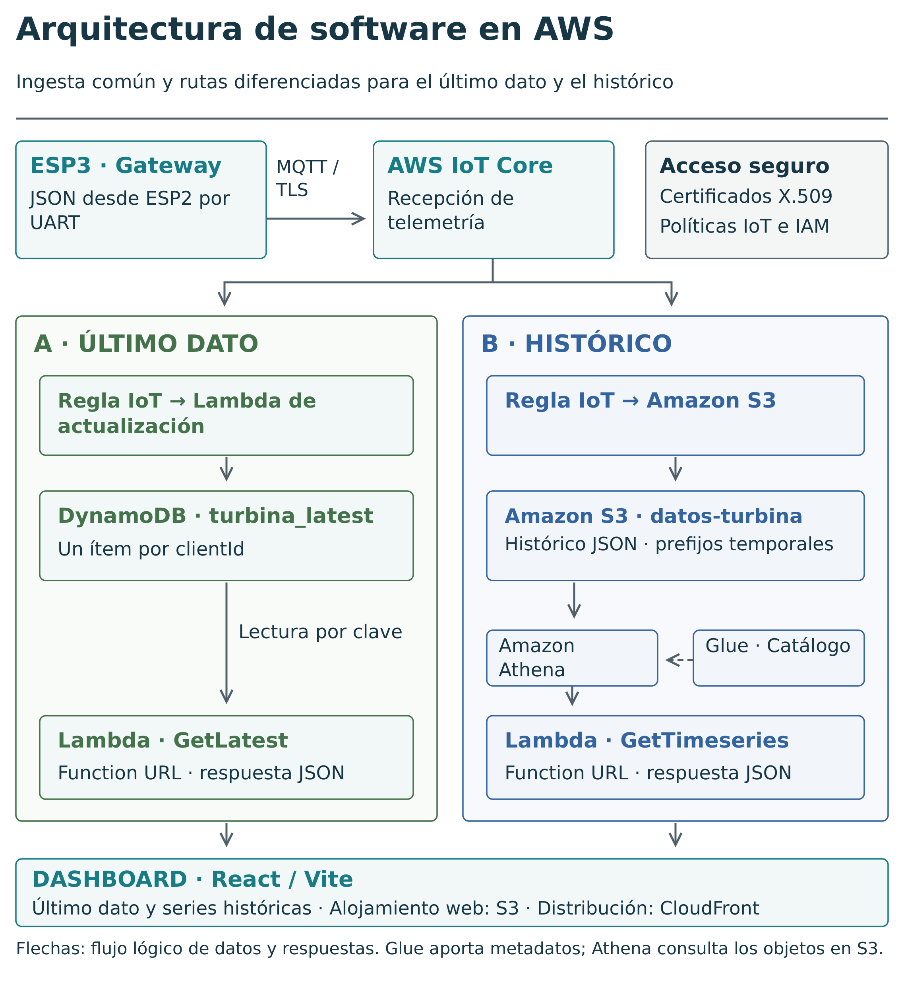

# Diseño e implementación de la arquitectura de software en AWS

En este capítulo se describe la arquitectura de software implementada en AWS para la recepción,  el almacenamiento, la extracción y la visualización de datos del sistema. La capa de hardware embebido transforma señales del mundo físico en mensajes de tipo **json** que son enviados a AWS para convertirlos en información disponible e histórica para el dashboard para consultas analíticas o validación experimental. La arquitectura se implementó a partir de servicios de tipo **serverless**, los cuales no requieren del despliegue de servidores tipo instancias EC2 para funcionar o ejecutar las funciones. En este proceso, se usa **AWS IoT Core** para la recepción **MQTTs**, reglas IoT para enrutamiento, Amazon **DynamoDB** para procesar el último paquete de datos disponible, **Amazon S3** para almacenamiento de datos históricos en estructura **json**, **AWS Glue** Data Catalog para metadatos y ETL, Amazon **Athena** para automatizar consultas SQL, **AWS Lambda** Function URLs para exponer funciones y consultas HTTP y Amazon **CloudFront** + **S3** para distribuir la interfaz web [@botta_cloud_iot_2016; @marjani_big_iot_2017; @aws_serverless_lens; @aws_iot_rules; @aws_dynamodb_core_components; @aws_athena_glue_catalog].

Para este trabajo, la decisión de usar servicios administrados responde a 3 razones: 1) Se desea analizar la operación del sistema sin la administración y mantenimiento de servidores, 2) Se busca escalamiento por uso sin mayor complejidad arquitectural ya que el sistema puede crecer en número de turbinas, frecuencia de muestreo y tiempo de operación, 3) El sistema tiene dos patrones de visualización, por una parte requiere actualización constante del último paquete de datos con baja latencia (**DynamoDB**) y por otra parte proporciona series históricas filtradas por rango de fechas y variables (**S3** + Glue + **Athena**) [@aws_serverless_lens; @hashem_bigdata_cloud_2015; @marjani_big_iot_2017; @aws_dynamodb_core_components; @aws_s3_prefixes; @aws_athena_partitions].

{#fig-cap4-arquitectura-software-aws width=100% fig-align="center" fig-pos="H"}

```{=latex}
\clearpage
```

La @fig-cap4-arquitectura-software-aws sintetiza la arquitectura adoptada en este trabajo. El proceso inicia en la ESP3, la cual actúa como gateway y publica la estructura json mediante MQTTs en AWS IoT Core. Desde IoT Core, el mensaje se distribuye a dos rutas diferentes: 1) La ruta Latest para mantener el último paquete de datos actualizado a través de DynamoDB, 2) La ruta histórica para mantener la base de datos histórica y consultarla cuando el usuario lo requiera. El dashboard desplegado mediante S3 + CloudFront consume datos de la BD mediante Lambda Functions URLs.

## Propósito de la capa cloud

La capa cloud tiene como propósito reemplazar lo que en la tesis de maestría sobre el prototipado y análisis comparativo de dos turbinas eólicas de eje vertical se presentó como la arquitectura de software en servidor local mediante Python + SQL + ShinyApps de R [@gomez_prototipado_2024]. En este caso, el subsistema Edge mide las señales in situ y las transmite, mientras que la capa Cloud garantiza una ingesta segura de los datos, persistencia, consulta, exposición HTTP y visualización adaptada. Por lo tanto, la nube no es solo un repositorio para una base de datos, en este caso permite desarrollar una arquitectura de procesamiento liviano, segura y escalable que convierte la información del generador eólico de eje vertical en información útil para el usuario [@botta_cloud_iot_2016; @marjani_big_iot_2017; @aws_iot_rules; @aws_lambda_function_urls; @aws_serverless_lens].

La arquitectura planteada separa responsabilidades entre servicios con el propósito de evitar errores o procesos innecesarios. **AWS IoT Core** recibe el paquete de datos y lo enruta mediante políticas IoT, **DynamoDB** sostiene el último paquete de datos, **Amazon S3** almacena histórico, **Athena** ejecuta SQL sobre el DataLake, **AWS Lambda** encapsula la lógica de consulta mediante funciones y **CloudFront** distribuye el FrontEnd. Esta separación mediante servicios es muy interesante porque permite separar responsabilidades, niveles de permisos, determinar los costos con precisión y mayor escalabilidad por componente sin mayores ajustes arquitecturales [@aws_iot_rules; @aws_dynamodb_core_components; @aws_s3_prefixes; @aws_athena_glue_catalog; @aws_lambda_function_urls; @aws_cloudfront_developer_guide].

La capa cloud puede entenderse como una aproximación de software como servicio para el monitoreo del sistema eólico. El usuario no interactúa directamente con scripts, servidores o bases de datos, sino con un dashboard web que consume servicios como Lambda, DynamoDB, S3, Athena y CloudFront. De esta manera, la arquitectura transforma la telemetría enviada por el hardware en un servicio digital de consulta y visualización [@mell_grance_nist_cloud_2011; @aws_serverless_lens; @aws_lambda_function_urls; @aws_dynamodb_core_components; @aws_athena_glue_catalog; @aws_cloudfront_developer_guide].

## Requisitos funcionales y no funcionales

Los requisitos funcionales de la arquitectura presentada se obtienen a partir del análisis y depuración del sistema. La ESP2 genera un contrato **json** que obedece a una lógica y responde a	 necesidades específicas y es enviado a AWS por la ESP3. En la nube se debe recibir mensajes **MQTTs**, validar la identidad del dispositivo que envía los datos, enrutar la telemetría recibida, mantener operativo el último valor por clientId, almacenar el histórico, permitir consultas SQL por rango temporal, ejecutar las funciones **Lambda** y exponer respuestas HTTP al dashboard. Como se ha mostrado, esto responde a una secuencia de sucesos y eventos en el tiempo, por lo que se debe conservar estructuras y variables estables porque cualquier cambio por mínimo que sea puede alterar el contrato **json** y por ende la lógica en AWS [@iso_ieee_29148_2018; @rfc8259_json; @aws_iot_protocols; @aws_iot_x509; @aws_iot_rules; @aws_dynamodb_core_components].

| Requisito | Servicio principal | Decisión implementada | Justificación |
|---|---|---|---|
| Ingesta segura | AWS IoT Core | MQTT/TLS en puerto 8883 | Autenticación por certificado y broker administrado |
| Autorización del dispositivo | AWS IoT Policy | Política asociada a certificado X.509 | Controla conexión, publicación y tópico |
| Último dato | DynamoDB | Tabla `turbina_latest`, PK `clientId` | Lectura rápida para tarjetas del dashboard |
| Histórico | Amazon S3 | Bucket `datos-turbina`, prefijo `processed/` particionado | Almacenamiento económico y durable |
| Catálogo | AWS Glue Data Catalog | Base `iot_db`, tabla `raw_processed` | Metadatos para consulta SQL |
| Consulta histórica | Amazon Athena | SQL sobre S3/Glue | Series temporales por rango y variable |
| API serverless | AWS Lambda Function URLs | `GetLatest` y `GetTimeseries` | Endpoints HTTP simples para React |
| Visualización | S3 + CloudFront | Dashboard React/Vite | Frontend estático distribuido |

: Requisitos funcionales de la arquitectura AWS. {#tbl-cap4-requisitos}

Por otra parte, los requisitos no funcionales se relacionan con aspectos de seguridad, costo, mantenibilidad y escalabilidad de la arquitectura. En términos de seguridad, en este proyecto se implementa un nivel aceptable pero que podría ser mejor. Se implementa **MQTT** sobre **TLS** ya que así lo requiere **AWS IoT Core**, certificados **X.509** que genera AWS y se embeben en el firmware de ESP3, permisos mínimos de **IAM**, políticas IoT restrictivas y **CORS** controlado para la interacción con el FrontEnd. Adicionalmente, el costo es otro requisito importante a satisfacer, optimizarlo exige separar las consultas frecuentes de último dato de las consultas de datos históricos, dado que son más pesadas y requieren un tratamiento diferente. La mantenibilidad del flujo requiere una estructura de datos clara, nombres claros y consistentes de los recursos, variables del sistema documentadas, roles documentados y trazabilidad de errores. Por último, la escalabilidad requiere particiones temporales, límites de consultas y una ruta para transformar **json** pequeños en parquet y así optimizar la estructura de datos de manera que se adapte a la arquitectura presentada [@nist_ir_8228; @aws_iot_security_best_practices; @aws_iot_x509; @aws_serverless_lens; @aws_athena_partitions; @apache_parquet_format].

## Flujo general de datos

El flujo de datos se puede representar mediante la implementación de una cadena de servicios especializados para cada etapa. La ESP3 comunica el sistema físico con la arquitectura cloud a través del envío del contrato **json** a un tópico **MQTTs**, **AWS IoT Core** recibe los datos enviados por ESP3, una regla IoT toma acciones sobre los datos recibidos, **DynamoDB** se encarga de conservar el último paquete de datos, **Amazon S3** almacena el histórico, **AWS Glue** cataloga las particiones para el ETL, **Athena** ejecuta las consultas SQL, las funciones **Lambda** entregan resultados HTTP y el dashboard desplegado sobre **React/Vite** muestra los datos más recientes en “cards” por variable y gráficos históricos. Se puede resumir de la siguiente manera: [@aws_iot_protocols; @aws_iot_rules; @aws_dynamodb_core_components; @aws_s3_prefixes; @aws_athena_glue_catalog; @aws_lambda_function_urls].

```text
ESP3 Gateway
  -> MQTT/TLS
  -> AWS IoT Core
  -> IoT Rule
  -> Ruta Latest: ActualizarUltimoDatoDynamo -> DynamoDB ->
  -> Lambda GetLatest -> Function URL
  -> Ruta Histórica: S3 -> Glue Data Catalog -> Athena -> 
  -> Lambda GetTimeseries -> Function URL
  -> React + Vite
  -> S3 + CloudFront
```

La separación entre ruta *Latest* e histórica es una decisión central. El último dato se consulta de forma frecuente, por ejemplo, cada cierto número de segundos desde el dashboard, 30 segundos en este caso; por eso se almacena en **DynamoDB**, que permite lectura directa por clave. En cambio, el histórico se consulta por rangos de tiempo, variables y periodos específicos; por eso se almacena en **S3**, se cataloga con Glue y se consulta con **Athena**. Esta separación evita usar **Athena** como base operativa de baja latencia y evita usar **DynamoDB** como repositorio histórico de análisis pesado [@aws_dynamodb_core_components; @aws_s3_prefixes; @aws_athena_glue_catalog; @aws_athena_partitions; @aws_serverless_lens].

<!-- INICIO UML: fig-uml-despliegue -->

La @fig-uml-despliegue muestra la distribución del software entre los dispositivos locales, los servicios administrados de AWS y el navegador del usuario. Los tres nodos ESP32-C6 ejecutan funciones diferenciadas de adquisición, integración y comunicación con la nube, conectadas mediante ESP-NOW, UART y MQTT sobre TLS. En AWS, IoT Core recibe la telemetría y las funciones Lambda realizan operaciones de actualización y consulta. DynamoDB conserva el último registro disponible, mientras que S3 almacena el histórico que consulta Athena con apoyo de los metadatos de Glue. El dashboard se ejecuta en el navegador y utiliza conexiones HTTPS para consultar las funciones Lambda; sus archivos se alojan en S3 y se distribuyen mediante CloudFront. Esta representación permite identificar dónde se ejecuta cada programa, qué servicios utiliza y cuáles son sus conexiones con el resto del sistema.

```{=latex}
\FloatBarrier
\begin{landscape}
\begingroup
\singlespacing
\captionsetup{font=small}
```

{#fig-uml-despliegue width=100% fig-align="center" fig-pos="H"}

```{=latex}
\endgroup
\end{landscape}
\FloatBarrier
```

<!-- FIN UML: fig-uml-despliegue -->

## Ingesta segura con **AWS IoT Core**

**AWS IoT Core** funciona como punto de entrada de la arquitectura cloud planteada. La ESP3 se conecta como cliente a **AWS IoT Core** mediante **MQTT** usando **TLS** y certificados **X.509** para asegurar la transmisión de los datos. Esta estructura busca que no se expongan las credenciales de usuario de AWS directamente en el firmware de la ESP3. Desde la visión de la seguridad, el certificado **X.509** se usa para autenticar el dispositivo ante AWS, la política IoT autoriza o deniega las acciones que puede ejecutar y el tópico **MQTT** define el canal lógico de publicación de los datos [@aws_iot_protocols; @oasis_mqtt5; @rfc8446; @aws_iot_x509; @aws_iot_policies; @aws_iot_security_best_practices].

En la implementación se utilizó la política ESP32C6-Policy y el tópico sensor/data. La política permite conectar, publicar, suscribirse y recibir mensajes. Es importante tener presente que para una versión escalable a otros dispositivos es necesario restringir iot:Connect al clientId esperado y limitar la publicación al tópico requerido. Esta restricción evita que un certificado comprometido publique en rutas ajenas al prototipo o suplante otros dispositivos [@aws_iot_policies; @aws_iot_x509; @aws_iot_security_best_practices; @nist_ir_8228].

La regla IoT también tiene como propósito desacoplar el firmware de los servicios posteriores. La ESP3 no requiere comunicarse con **DynamoDB**, o con **S3**, o con otro servicio de tipo IoT, solo publica en un tópico y se relaciona con **AWS IoT Core**. Una vez se recibe el paquete **json**, la regla IoT procesa el mensaje y ejecuta las acciones configuradas. Esta separación es útil porque permite que la arquitectura de hardware no genere múltiples conexiones a AWS y que se pueda modificar la arquitectura de software sin tocar el hardware siempre que se conserve la estructura **JSON** que se recibe en AWS IoT Core [@aws_iot_protocols; @aws_iot_rules; @rfc8259_json; @aws_serverless_lens; @marjani_big_iot_2017].

## Ruta de último dato: **DynamoDB**

La ruta *Latest* se plantea dada la necesidad de conocer el estado actual del sistema priorizando costos bajos de consulta y visualización. En el dashboard presentado, las cards de temperatura, humedad, presión, velocidad del viento y otras variables no requieren consultar los datos históricos permanentemente, solo se necesita el último registro válido por dispositivo. Por esta razón, se implementó la tabla turbina_latest en **DynamoDB**, con clientId como clave de partición [@aws_dynamodb_core_components; @aws_dynamodb_query; @aws_serverless_lens].

| Elemento | Valor implementado o recomendado | Función |
|---|---|---|
| Tabla | `turbina_latest` | Estado actual del dispositivo |
| Clave de partición | `clientId` | Identificación del gateway/dispositivo |
| Operación de escritura | `PutItem` o actualización por mensaje | Sobrescribe el último estado |
| Operación de lectura | `GetItem` | Consulta rápida desde `GetLatest` |
| Consumidor | Dashboard React | Tarjetas de último dato |

: Diseño lógico de la ruta de último dato en DynamoDB. {#tbl-cap4-dynamodb}

El uso de **DynamoDB** evita ejecutar consultas a **Athena** para refrescar el estado operativo del dashboard. Esto permite reducir latencia, costo y complejidad al depender solo de un servicio y resolución de la consulta por clave y no por filtrado sobre el histórico. Además, con la estructura planteada, se puede escalar muy fácilmente a múltiples turbinas u otros dispositivos a partir de un clientId diferente por dispositivo. Por la naturaleza de la arquitectura planteada, las estructuras de datos son flexibles y pueden añadirse nuevos campos para calidad de datos, trazabilidad de actualizaciones, o lo que el usuario requiera [@aws_dynamodb_core_components; @aws_dynamodb_query; @aws_athena_partitions; @aws_serverless_lens].

## Ruta histórica: **Amazon S3**

La ruta histórica almacena todos los mensajes recibidos desde la ESP3, la cual envía una estructura **json** con las variables y metadata definida cada diez segundos y que se almacenan en **Amazon S3**. Estos datos se almacenan en una estructura particionada por niveles a partir del tiempo **DD/MM/YY HH:mm:ss** que permite hacer uso de datos específicos y con alto nivel de granularidad. **S3** se usa como lago de datos por su durabilidad, bajo costo, capacidad de organizar objetos mediante prefijos y otras bondades como el control de versiones, niveles de seguridad, entre otros. En la implementación se usó un bucket llamado datos-turbina y una estructura temporal denominada processed/, con particiones por año, mes, día, hora y minuto (aproximadamente 5 paquetes/minuto). Esta organización facilita que **Athena** reduzca los datos escaneados cuando las consultas filtran por campos de partición, mejorando latencia y costos por consulta [@rfc8259_json; @aws_s3_prefixes; @aws_athena_partitions; @aws_athena_glue_catalog; @hashem_bigdata_cloud_2015; @marjani_big_iot_2017].

::: {.content-visible when-format="pdf"}

```{=latex}
\begin{flushleft}
\small\ttfamily
s3://datos-turbina/processed/\allowbreak year=2026/\allowbreak month=05/\allowbreak day=18/\allowbreak hour=15/\allowbreak minute=22/
\end{flushleft}
```

:::

::: {.content-visible unless-format="pdf"}

```text
s3://datos-turbina/processed/year=2026/month=05/day=18/hour=15/minute=22/
```

:::
Se definió usar la partición temporal planteada porque la telemetría IoT tiende a crecer de forma acumulativa, por ejemplo, en función del tiempo o evento que desencadena el muestreo. Si todos los **json** se almacenan en una única carpeta, se tendrán que escanear muchos objetos en cada consulta para encontrar lo requerido. Por el contrario, al particionar por timestamp, una consulta para un día u hora específica puede limitarse a los prefijos correspondientes. Esto mejora la latencia, reduce bastante los costos por consulta y facilita la navegación y mantenimiento del data lake del histórico [@aws_s3_prefixes; @aws_athena_partitions; @aws_athena_glue_catalog; @hashem_bigdata_cloud_2015; @marjani_big_iot_2017].

Una limitación de la versión actual es que los mensajes **json** pueden generar muchos objetos en **S3** si la frecuencia de publicación aumenta. Esta es una estrategia funcional para prototipado y validación, pero en una arquitectura más madura y con varios dispositivos si conviene compactar los datos por ventanas de tiempo y convertirlos a **Parquet**, reduciendo la cantidad de objetos y volumen escaneado por **Athena** [@rfc8259_json; @aws_s3_prefixes; @aws_athena_partitions; @aws_serverless_lens; @apache_parquet_format; @marjani_big_iot_2017].

## Catálogo y transformación con **AWS Glue**

**AWS Glue** cumple dos funciones en la arquitectura: 1) catalogar los datos históricos y 2) habilitar transformaciones hacia formatos más eficientes como **Parquet**. El Glue Data Catalog mantiene la base iot_db y la tabla raw_processed, que describe el esquema disponible para consultas con **Athena**. Sin catálogo, **Athena** no tendría una definición estructurada de columnas, tipos y particiones sobre los objetos almacenados en **S3** [@aws_athena_glue_catalog; @aws_glue_crawlers; @aws_s3_prefixes; @aws_athena_partitions].

Adicionalmente, la arquitectura también contempla trabajos Glue como Job ETL proceso y json_to_parquet_converter. El objetivo es convertir datos **json** hacia **Parquet** y preparar una capa optimizada para consulta de histórico en un entorno de múltiples dispositivos y demasiados datos. Se plantea para preparar una estructura más coherente con el diseño del data lake: primero se captura el dato crudo o procesado en **json** para trazabilidad; luego se transforma a un formato columnar para análisis eficiente [@rfc8259_json; @aws_glue_etl_jobs; @apache_parquet_format; @aws_athena_partitions; @marjani_big_iot_2017].

| Capa | Formato | Uso | Ventaja |
|---|---|---|---|
| Entrada histórica | json | Persistencia directa desde IoT | Simple, trazable y flexible |
| Catálogo | Glue Data Catalog | Esquema y particiones | Permite consulta SQL |
| Optimizada | Parquet | Consulta analítica | Reduce lectura y costo |

: Capas de datos previstas para el histórico IoT. {#tbl-cap4-capas-datos}

## Consulta histórica con Amazon **Athena**

**Athena** es un servicio de AWS que permite hacer consultas de datos en **S3** usando SQL **sin cargar previamente la información en una base de datos relacional**, lo que permite reducir costos. En este proyecto **Athena** ejecuta consultas sobre la tabla iot_db.raw_processed, filtrando por particiones temporales y ordenando por la variable timestamp. Esta capacidad es adecuada para el dashboard histórico, en el cual el usuario puede solicitar series de las diferentes variables en un intervalo de tiempo determinado [@aws_athena_what_is; @aws_athena_glue_catalog; @aws_athena_partitions; @aws_s3_prefixes].

Un ejemplo lógico de consulta histórica es:

```sql
SELECT *
FROM iot_db.raw_processed
WHERE year = '2026'
  AND month = '05'
  AND day = '15'
ORDER BY "timestamp" DESC
LIMIT 20;
```
Debido a las necesidades identificadas en este proyecto, se considera obligatorio el uso de particiones de timestamp para las consultas desde **Lambda**. Si la función **Lambda** `GetTimeseries` permite rangos muy amplios o no filtra por year, month y day, **Athena** podría escanear más datos de los requeridos y aumentar la latencia o costos innecesarios que encarecen la arquitectura. Por esta razón, en la función **Lambda** debe implementarse validación de fechas, limitar resultados y mapear explícitamente las variables permitidas, evitando usar SQL con parámetros no controlados que puedan generar errores en las consultas [@aws_athena_partitions; @aws_lambda_function_urls; @aws_serverless_lens; @aws_athena_prepared_statements; @owasp_sql_injection_prevention].

## Capa API con **Lambda** Function URLs

Para reducir costos, la capa API para interconectar el dashboard con la fase de almacenamiento se implementa mediante dos funciones de **AWS Lambda** expuestas mediante Function URLs. Este mecanismo permite la creación de endpoints HTTPs directos para funciones predeterminadas con configuración **CORS** y sin desplegar una API REST por completo. Para el propósito de este proyecto, esta forma soluciona la necesidad, mantiene el diseño **serverless** y puede escalarse de manera segura [@aws_lambda_function_urls; @aws_lambda_url_cors; @aws_serverless_lens; @aws_iam_least_privilege].

Las dos funciones son GetLatest y GetTimeseries. GetLatest gestiona todo el ecosistema del “último dato” consultando **DynamoDB** por clientId. GetTimeseries gestiona la ruta para la data histórica construyendo una consulta SQL mediante **Athena** y devuelve puntos para la visualización en el dashboard. Esta división de tareas evita mezclar dos patrones de acceso diferentes dentro de una única función y facilita asignar permisos mínimos a cada rol **IAM** conservando la práctica de mínimo privilegio [@aws_lambda_function_urls; @aws_dynamodb_query; @aws_athena_what_is; @aws_athena_partitions; @aws_iam_least_privilege].

```{=latex}
\begingroup
\small
\setlength{\tabcolsep}{3pt}
\renewcommand{\arraystretch}{1.25}

\begin{center}
\refstepcounter{table}\label{tbl-cap4-lambdas}
\textbf{Tabla nro. \thetable: Funciones Lambda principales de la capa API y procesamiento.}

\vspace{0.4em}

\begin{tabular}{p{0.22\textwidth} p{0.23\textwidth} p{0.23\textwidth} p{0.23\textwidth}}
\hline
\textbf{Función} & \textbf{Fuente} & \textbf{Consulta} & \textbf{Uso} \\
\hline

\texttt{GetLatest} &
DynamoDB \newline \texttt{turbina\_latest} &
Lectura por \newline \texttt{clientId} &
Cards de último dato \\

\texttt{GetTimeseries} &
Athena \newline \texttt{raw\_processed} &
Rango temporal &
Gráfico histórico \\

\shortstack[l]{\texttt{Actualizar}\\\texttt{UltimoDato}\\\texttt{Dynamo}} &
Regla IoT &
Actualiza \newline \texttt{latest} &
Mantener último dato \\

\hline
\end{tabular}
\end{center}

\endgroup
```

Las Function URLs deben responder con encabezados **CORS** adecuados para el dominio del dashboard. Durante la depuración se identificó que duplicar Access-Control-Allow-Origin puede producir errores en navegador; por ello, la arquitectura debe definir una sola fuente de verdad para **CORS**: o se configura en la Function URL o se controla en el código **Lambda**, pero no de manera conflictiva en ambos lugares. Para despliegue público, el origen permitido debe restringirse al dominio **CloudFront** del dashboard [@aws_lambda_url_cors; @mdn_cors_multiple_origin; @aws_cloudfront_developer_guide; @aws_iam_least_privilege].

## Roles **IAM** y mínimo privilegio

**IAM** es un servicio de AWS que se especializa en seguridad y permite que cada servicio de la arquitectura actúe sobre otros recursos sin exponer credenciales estáticas. La arquitectura debe asignar permisos según las necesidades que llevan a la creación de cada función: GetLatest requiere permisos para leer **DynamoDB**, mientras que GetTimeseries requiere ejecutar **Athena**, leer metadatos de Glue y acceder a resultados en **S3**. Por ejemplo, una regla IoT que escribe en **S3** o invoca **Lambda** no debería tener permisos sobre recursos ajenos, Glue debe limitarse a rutas y bases del proyecto y **AWS IoT Core** debe escribir en **S3** únicamente mediante una regla IoT autorizada por un rol **IAM**, no mediante credenciales expuestas en alguna ESP. Allí radica la importancia de **IAM** [@aws_iam_least_privilege; @aws_lambda_execution_role; @aws_iot_rules; @aws_iot_s3_rule_action; @aws_glue_iam_permissions; @aws_s3_bucket_policies].

```{=latex}
\begingroup
\small
\setlength{\tabcolsep}{3pt}
\renewcommand{\arraystretch}{1.25}

\begin{center}
\refstepcounter{table}\label{tbl-cap4-iam}
\textbf{Tabla nro. \thetable: Permisos mínimos esperados por servicio.}

\vspace{0.4em}

\begin{tabular}{p{0.25\textwidth} p{0.36\textwidth} p{0.31\textwidth}}
\hline
\textbf{Rol o función} & \textbf{Permiso mínimo} & \textbf{Recurso esperado} \\
\hline

\texttt{GetLatest-role} &
\texttt{dynamodb:GetItem} &
Tabla \texttt{turbina\_latest} \\

\texttt{GetTimeseries-role} &
\texttt{athena:StartQueryExecution} \newline
\texttt{athena:GetQueryExecution} \newline
\texttt{athena:GetQueryResults} &
Workgroup Athena \newline
del proyecto \\

\texttt{GetTimeseries-role} &
\texttt{glue:GetDatabase} \newline
\texttt{glue:GetTable} \newline
\texttt{glue:GetPartitions} &
Base \texttt{iot\_db} \newline
Tabla \texttt{raw\_processed} \\

\texttt{GetTimeseries-role} &
\texttt{s3:GetObject} \newline
\texttt{s3:PutObject} \newline
\texttt{s3:ListBucket} &
Buckets de datos \newline
y resultados \\

\shortstack[l]{\texttt{AWSIoTRule}\\\texttt{ActionRole}} &
\texttt{s3:PutObject} \newline
\texttt{dynamodb:PutItem} \newline
\texttt{lambda:InvokeFunction} &
Recursos específicos \newline
del proyecto \\

\shortstack[l]{\texttt{AWSGlue}\\\texttt{ServiceRole-IoT}} &
Lectura/escritura \newline
controlada &
Prefijos \texttt{processed/} \newline
y \texttt{optimized-parquet/} \\

\hline
\end{tabular}
\end{center}

\endgroup
```

Por otra parte, en las buenas prácticas de seguridad de la arquitectura de AWS se recomienda implementar el principio de mínimo privilegio, el cual consiste en otorgar los permisos mínimos indispensables para realizar las funciones necesarias a personas, programas o procesos. Esto también facilita la depuración, un rol granular permite identificar rápidamente qué permiso falta cuando algo falla, en comparación con roles con permisos muy amplios [@aws_iam_least_privilege; @aws_serverless_lens; @aws_iot_security_best_practices; @nist_ir_8228].

## Dashboard web con React, **S3** y **CloudFront**

En este proyecto la visualización se implementa como una aplicación **React/Vite**, en comparación con la visualización de referencia implementada con una ShinyApp de R. El frontend representado mediante un dashboard consulta GetLatest para actualizar cards con el último dato para diferentes variables y consulta GetTimeseries para construir gráficos históricos con Recharts. Esta separación permite que el usuario visualice el estado operativo y, al mismo tiempo, explore el comportamiento temporal de variables como velocidad del viento, temperatura o voltaje [@gomez_prototipado_2024; @react_docs; @vite_docs; @recharts_docs; @aws_lambda_function_urls].

El despliegue del dashboard se realiza como sitio estático en **S3** y distribución mediante **CloudFront**. En este patrón, **S3** funciona como origen del contenido y **CloudFront** como capa de distribución global y control de acceso. Para una Single Page Application, el objeto raíz debe ser index.html, y en una configuración completa se deben mapear errores 403/404 hacia index.html para soportar rutas del lado del cliente [@aws_s3_static_website; @aws_cloudfront_developer_guide; @aws_cloudfront_custom_error_pages; @vite_docs].

Por otra parte, desde la visión de la seguridad, el bucket donde se aloja el dashboard no debería exponerse públicamente si el servicio de AWS **CloudFront** es la puerta de entrada. La práctica recomendada es usar Origin Access Control u otro mecanismo equivalente para que los usuarios accedan al frontend mediante **CloudFront** y no directamente al bucket. También se recomienda restringir **CORS** en las Function URLs al dominio final del dashboard [@aws_cloudfront_oac; @aws_s3_bucket_policies; @aws_lambda_url_cors; @aws_iam_least_privilege].

<!-- INICIO UML: fig-uml-secuencia-consultas -->

La @fig-uml-secuencia-consultas modela las dos interacciones principales mediante las cuales el dashboard obtiene información del sistema. La consulta de último dato utiliza la función GetLatest para recuperar de DynamoDB el registro asociado al identificador del dispositivo y actualizar las tarjetas de las variables. La consulta histórica se inicia cuando el usuario selecciona una variable y un intervalo de tiempo; GetTimeseries solicita a Athena los datos correspondientes, almacenados en S3 y descritos por el catálogo de Glue. Para esta segunda interacción, el modelo representa el inicio de la consulta, el seguimiento de su estado y la recuperación de los resultados que permiten construir el gráfico histórico. La separación de ambas rutas permite actualizar frecuentemente el estado del sistema y reservar las consultas históricas para las solicitudes de análisis del usuario.

```{=latex}
\FloatBarrier
\begin{landscape}
\begingroup
\singlespacing
\captionsetup{font=small}
```

{#fig-uml-secuencia-consultas width=100% fig-align="center" fig-pos="H"}

```{=latex}
\endgroup
\end{landscape}
\FloatBarrier
```

<!-- FIN UML: fig-uml-secuencia-consultas -->

## Evidencias de implementación

Aunque el capítulo principal utiliza una figura limpia de arquitectura, se usan capturas de consola como evidencias de implementación [@aws_iot_protocols; @aws_serverless_lens].

| Evidencia | Qué demuestra | Ubicación recomendada |
|---|---|---|
| S3 `datos-turbina` | Existencia del lago de datos y prefijos | Anexo o capítulo 5 |
| DynamoDB `turbina_latest` | Último dato por `clientId` | Capítulo 5 |
| Athena `iot_db.raw_processed` | Consulta histórica exitosa | Capítulo 5 |
| Glue `iot_db` | Catálogo de datos | Anexo técnico |
| Lambda | Funciones de consulta/procesamiento | Anexo técnico |
| CloudFront | Dashboard publicado | Capítulo 5 |
| Política IoT | Autorización MQTT | Anexo de seguridad |

: Evidencias recomendadas para documentación y validación. {#tbl-cap4-evidencias}

## Síntesis del capítulo

La arquitectura cloud desarrollada en AWS convierte los mensajes publicados por la ESP3 en información operativa e histórica útil para el usuario. **AWS IoT Core** recibe los datos por **MQTTs**, **DynamoDB** conserva el último dato filtrando por `clientId`, **S3** almacena el histórico particionado, Glue cataloga los datos, **Athena** permite hacer consultas SQL a **S3**, **Lambda** expone endpoints HTTP y **CloudFront** despliega el dashboard web. Esta organización evita concentrar toda la solución en un único servicio y permite optimizar cada ruta según sus necesidades de uso [@aws_iot_protocols; @aws_iot_rules; @aws_dynamodb_core_components; @aws_s3_prefixes; @aws_athena_glue_catalog; @aws_lambda_function_urls].

La propuesta final queda plenamente relacionada con el flujo y necesidades reales del sistema: Gateway ESP3, **AWS IoT Core**, regla IoT, **DynamoDB**/**S3**, Glue/**Athena**, **Lambda** Function URLs y React/**CloudFront**. El resultado obtenido es una arquitectura **serverless**, modular, segura, trazable y escalable para monitoreo de generación eólica de pequeña escala, con separación entre ingesta segura, almacenamiento híbrido, consulta histórica y visualización web, que puede adaptarse en otro tipo de procesos de generación eléctrica de cualquier escala o en otros ámbitos donde se requiera medición y almacenamiento de datos [@gomez_prototipado_2024; @botta_cloud_iot_2016; @marjani_big_iot_2017; @aws_serverless_lens; @aws_lambda_function_urls; @aws_cloudfront_developer_guide].

