# Pruebas de despliegue y validación

En este capítulo se presenta la estrategia de validación del sistema desarrollado. Este proceso consiste en verificar progresivamente que cada etapa cumpla con su función dentro del flujo extremo a extremo que se propone. Este flujo inicia con la medición física de datos en las tarjetas ESP1 y ESP2, comunicación local, serialización hacia ESP3, consolidación de la estructura JSON, publicación a través de MQTTs, recepción e ingesta en AWS IoT Core, persistencia del último paquete en DynamoDB y S3, consistencia en las consultas de Athena, exposición por Lambda y visualización web. Esta organización evita evaluar el sistema únicamente desde el resultado final y permite identificar en qué tramo se origina una falla [@iso_ieee_29148_2018; @nist_ir_8228; @aws_iot_protocols; @aws_iot_rules; @aws_dynamodb_core_components; @aws_athena_glue_catalog].

La validación se diseñó con un enfoque incremental. Primero se verifican sensores y periféricos de manera aislada; luego se prueban las tres ESP32-C6 por separado; posteriormente se validan los enlaces ESP-NOW y UART; después se verifica la publicación desde ESP3 hacia AWS IoT Core; y finalmente se comprueba la persistencia, consulta y visualización. Esta secuencia es coherente con una arquitectura distribuida, ya que evita depurar simultáneamente errores de hardware, firmware, red, nube y frontend [@iso_ieee_29148_2018; @nist_ir_8228; @espressif_freertos; @espressif_espnow; @espressif_uart_driver; @aws_iot_protocols].

## Estrategia general de validación

En este trabajo, esta organización se denomina **procedimiento de validación incremental por etapas con trazabilidad de evidencias**. El nombre identifica la secuencia adoptada para comprobar el sistema, desde la adquisición hasta la visualización. Cada etapa relaciona la condición de prueba, el procedimiento, el resultado observado y la evidencia disponible; no se presenta como una certificación del prototipo.

Para la validación del sistema se proponen cinco niveles con el propósito de medir todo el proceso: 1) El nivel uno corresponde a la validación física de mediciones (sensores tanto en ESP1 como en ESP2), 2) El nivel dos busca validar el correcto funcionamiento del firmware a partir de la evaluación de las tareas concurrentes, 3) El nivel tres se encarga de la validación del funcionamiento de la comunicación local (tanto ESP-NOW entre ESP1-ESP2 y comunicación UART entre ESP2-ESP3), en el nivel cuatro se hace la validación de la arquitectura Cloud propuesta y en el nivel cinco a la validación del funcionamiento esperado del dashboard. La Tabla 1 resume esta estructura.

| Nivel | Alcance | Pregunta de validación | Evidencia esperada |
|---|---|---|---|
| V1 | Sensores y señales | ¿La variable física se captura con rango y unidad coherentes? | Lecturas por consola, comparación con patrón o instrumento externo |
| V2 | Firmware por nodo | ¿Cada ESP ejecuta sus tareas sin bloqueo crítico? | Logs, LED de estado, memoria disponible, reinicios controlados |
| V3 | Comunicación local | ¿ESP1, ESP2 y ESP3 intercambian datos completos? | Recepción ESP-NOW, json por UART, estado de conexión |
| V4 | Nube AWS | ¿El mensaje llega y se almacena correctamente? | IoT Core, DynamoDB, S3, Glue, Athena |
| V5 | Dashboard | ¿El usuario consulta último dato e histórico? | Tarjetas, gráfico, manejo de errores y CORS |

: Niveles de validación propuestos para el sistema extremo a extremo. {#tbl-validacion-niveles}

La validación de la herramienta es una etapa muy importante, pues no debe limitarse únicamente a comprobar que se visualizan datos en pantalla. El sistema de monitoreo pretende tener disponible un medio para verificar que esos datos conservan significado físico, que están entre rangos esperables, que el mensaje mantiene una estructura estable, que las rutas cloud almacenan la información como se requiere y que el usuario puede consultar datos sin depender de la consola de AWS o de un servidor local. Por esta razón, cada prueba registra la entrada, procedimiento, criterio de aceptación y evidencia. 

## Validación de la ESP1: adquisición de campo

La ESP1 se valida como nodo de adquisición en el generador. Sus pruebas se orientan a comprobar tres funciones: lectura GPS, medición de voltaje y estimación de RPM para la velocidad de la turbina. Para la lectura del GPS, la evidencia mínima es observar coordenadas válidas y estado `gps_fix` coherente. Para voltaje, la evidencia mínima es comparar la lectura calculada por firmware contra un multímetro o instrumento de medición. Para RPM, la evidencia mínima es contrastar el conteo de pulsos con una velocidad conocida o con un tacómetro externo.

| Código | Prueba | Procedimiento | Criterio de aceptación |
|---|---|---|---|
| ESP1-01 | GPS | Encender el módulo, esperar fijación y registrar latitud/longitud | `gps_fix=true` y coordenadas dentro del rango esperado |
| ESP1-02 | Voltaje | Aplicar diferentes niveles de tensión acondicionada y comparar con patrón | Error dentro del rango definido para prototipo |
| ESP1-03 | RPM | Generar pulsos controlados o rotación conocida | RPM proporcional a pulsos y ventana temporal |
| ESP1-04 | ESP-NOW TX | Enviar estructura `mensaje_t` hacia ESP2 | Confirmación por log de envío y recepción en ESP2 |

: Casos de validación del nodo ESP1. {#tbl-validacion-esp1}

Con la medición de voltaje es necesario tener un cuidado especial, pues se trata de un circuito analógico, calibración **ADC** y cálculo digital. Adicionalmente, deben limitarse los rangos de voltaje en la instrumentación de manera que no se afecten los periféricos de la ESP1. El criterio de aceptación se define de acuerdo con la necesidad actual, la cual consiste en validar el funcionamiento de la arquitectura, considerando que los datos de voltaje ya fueron contrastados frente a multímetro y osciloscopio en la tesis de maestría sobre el prototipado y análisis comparativo de dos turbinas eólicas de eje vertical [@gomez_prototipado_2024]. Por esta razón, en esta etapa se verifica principalmente que la lectura sea estable, que se mantenga dentro de rangos seguros para el **ADC** y que pueda integrarse correctamente al flujo de datos del sistema [@espressif_esp32c6_adc_calibration; @kester_data_conversion_2005; @nist_ir_8228].

## Evidencias de validación por componente

```{=latex}
\FloatBarrier
```

### Evidencias (Prueba ESP1)

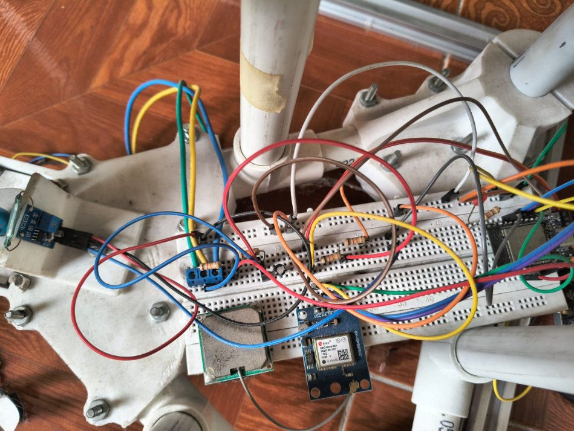{#fig-esp1-desenergizada width="90%" fig-align="center" fig-pos="H"}

Se desenergiza la tarjeta transmisora (ESP1) y se verifica que el sistema marque pérdida de enlace (`esp_now_connected=false`) y que `voltage` y `rpm` adopten valores controlados para evitar interpretaciones físicas erróneas.

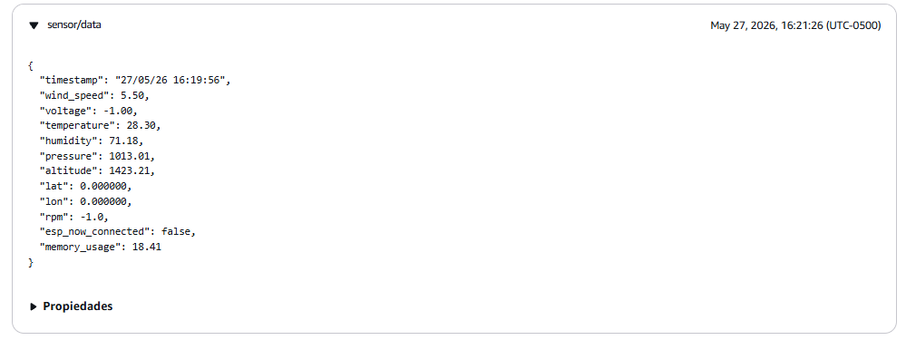{#fig-iotcore-payload-esp1 fig-cap="Cliente de prueba MQTT (AWS IoT Core): verificación del paquete con `esp_now_connected=false` y valores controlados en variables remotas." width="90%" fig-align="center" fig-pos="H"}

Se inspecciona en el cliente de prueba MQTT de AWS IoT Core el último mensaje publicado y se confirma la marca `esp_now_connected=false`, junto con el tratamiento de dato perdido en las variables provenientes de ESP‑NOW.

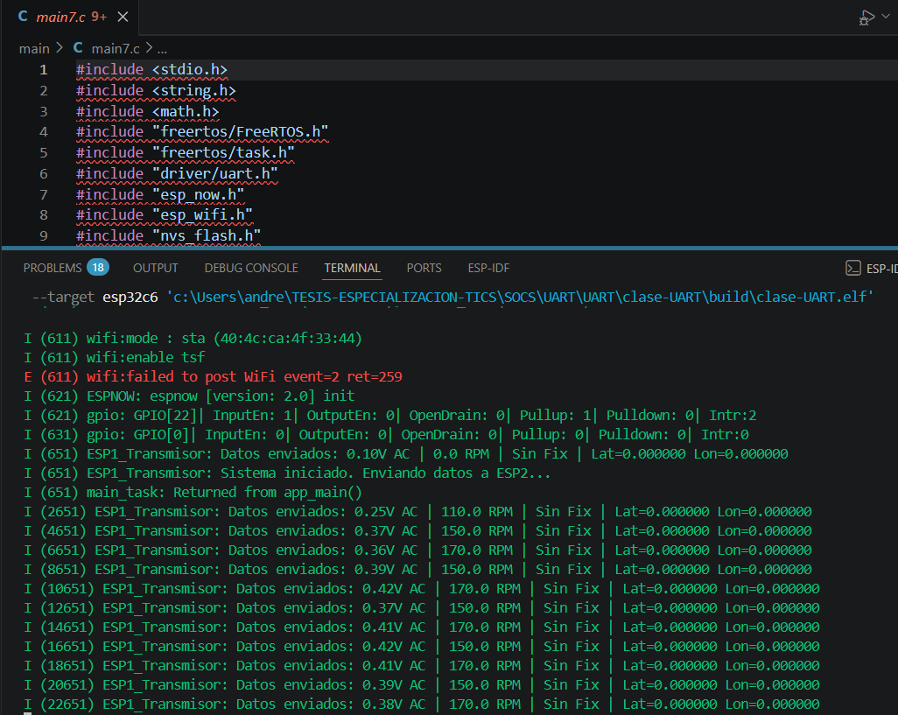{#fig-esp1-vscode-log fig-cap="Consola esp-idf (VS Code): verificación del flujo ESP1 → ESP2 tras reconexión." width="90%" fig-align="center" fig-pos="H"}

Se energiza nuevamente ESP1 mediante el PC y se valida en la consola del entorno esp-idf (VS Code) el restablecimiento del envío de datos y la recepción por parte de ESP2.

```{=latex}
\FloatBarrier
```

### Evidencias (Prueba ESP2)

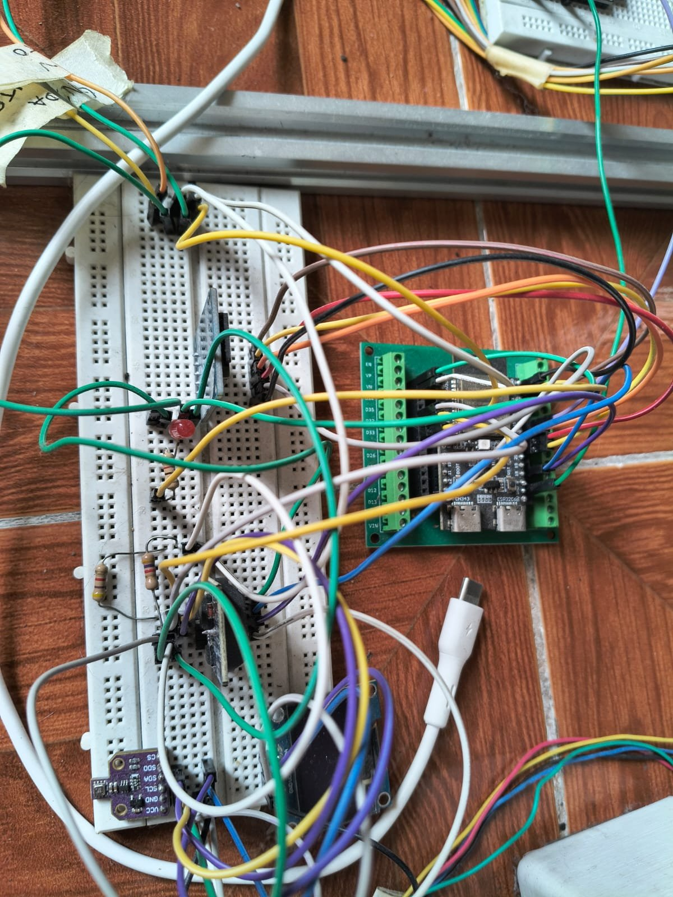{#fig-esp2-desenergizada fig-cap="ESP2 desenergizada: prueba de indisponibilidad en eslabón intermedio." width="65%" fig-align="center" fig-pos="H"}


Se desenergiza la tarjeta ESP2 para inducir la interrupción del flujo hacia el gateway, validando que la arquitectura refleja la pérdida del componente intermedio.

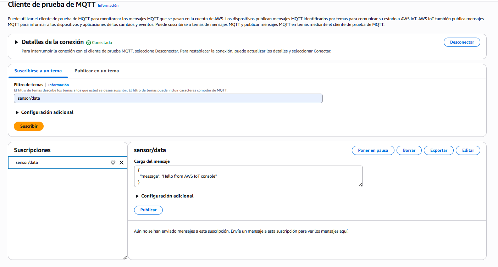{#fig-iotcore-sin-msg-esp2 fig-cap="Cliente de prueba MQTT (AWS IoT Core): ausencia de mensajes durante la desenergización de ESP2." width="90%" fig-align="center" fig-pos="H"}

Con ESP2 desenergizada, se verifica en el cliente MQTT que no ingresan nuevos mensajes al tópico, confirmando el comportamiento esperado cuando el puente UART no está operativo.

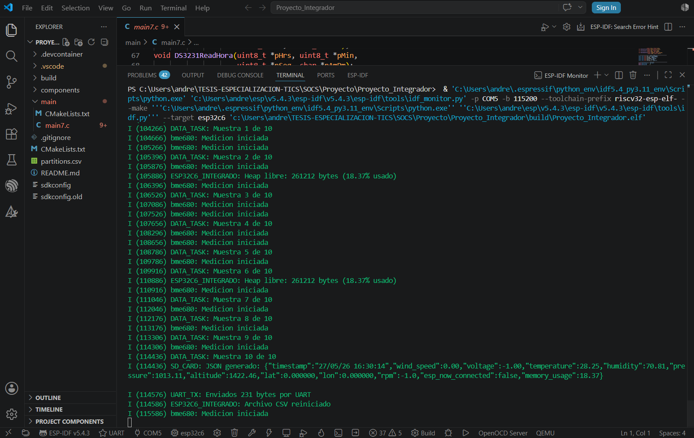{#fig-esp2-log-uart fig-cap="Consola esp-idf: re-energización de ESP2 y validación de transmisión por UART." width="90%" fig-align="center" fig-pos="H"}

Se energiza nuevamente ESP2 desde el PC y se verifica por consola el cumplimiento de la tarea de lectura/ensamble y la transmisión del json mediante UART hacia el gateway.

```{=latex}
\FloatBarrier
```

### Evidencias (Prueba ESP3)

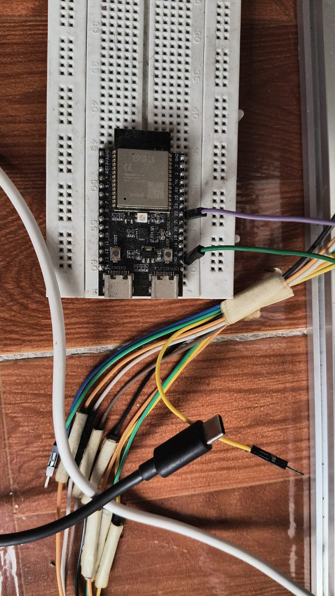{#fig-esp3-desenergizada fig-cap="ESP3 desenergizada: prueba en el gateway." width="49%" fig-align="center" fig-pos="H"}

Se desenergiza la ESP3 (gateway) para validar el escenario de indisponibilidad del componente que publica hacia AWS IoT Core.

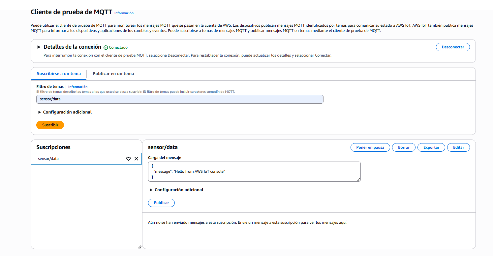{#fig-iotcore-sin-msg-esp3 fig-cap="Cliente de prueba MQTT (AWS IoT Core): ausencia de datos durante la desenergización de ESP3." width="90%" fig-align="center" fig-pos="H"}

Con el gateway sin energía, se confirma en el cliente MQTT que no se reciben mensajes en el tópico de ingesta, lo cual valida la dependencia del flujo respecto a la ESP3.

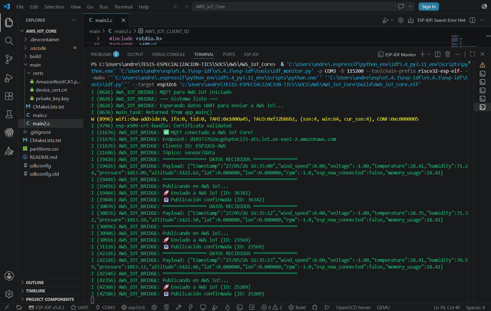{#fig-esp3-log-mqtt fig-cap="Consola esp-idf: verificación del funcionamiento de ESP3 al re-energizar." width="90%" fig-align="center" fig-pos="H"}

Se energiza nuevamente ESP3 y se comprueba por consola la ejecución del firmware y la publicación MQTT hacia AWS IoT Core.

**Síntesis de la prueba.** La prueba de ESP3 muestra que, al retirar la alimentación del gateway, se interrumpe la llegada de nuevos mensajes a AWS IoT Core. La publicación se restablece al energizar nuevamente la tarjeta, según las evidencias de consola presentadas. Esta comprobación identifica el papel de ESP3 en la salida hacia la nube; no cuantifica el tiempo de recuperación.

```{=latex}
\FloatBarrier
```

### Evidencias (Prueba AWS IoT Core)

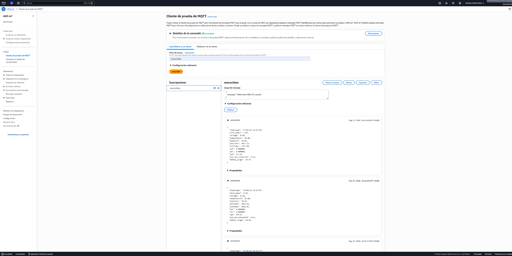{#fig-iotcore-recibiendo fig-cap="Cliente de prueba MQTT: recepción de mensajes en el tópico de ingesta." width="90%" fig-align="center" fig-pos="H"}

Se suscribe el cliente de prueba MQTT al tópico configurado y se verifica la recepción de mensajes con estructura json válida.

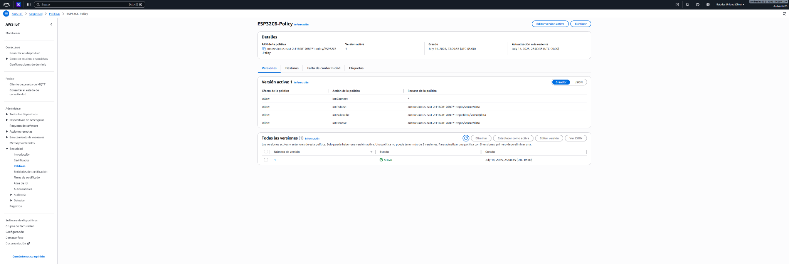{#fig-iot-policy fig-cap="Política IoT: validación de permisos asociados al dispositivo." width="90%" fig-align="center" fig-pos="H"}

Se verifica la política IoT asociada al certificado/dispositivo, confirmando que las acciones permitidas habilitan la conexión y la publicación en el tópico autorizado.

**Síntesis de la prueba.** Las evidencias de IoT Core permiten seguir la recepción del JSON y revisar los permisos asociados al dispositivo. Con ello se comprueba la conexión y publicación en el tópico usado durante la prueba, sin extender el resultado a una evaluación completa de seguridad.

```{=latex}
\FloatBarrier
```

### Evidencias (Prueba DynamoDB)

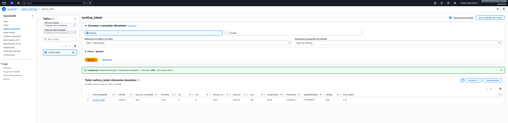{#fig-dynamodb-turbina-latest fig-cap="DynamoDB (`turbina_latest`): verificación del último paquete por `clientId`." width="90%" fig-align="center" fig-pos="H"}

Se valida en la tabla `turbina_latest` la existencia de un único elemento actualizado para el `clientId`, confirmando la persistencia del “último dato” consumido por el dashboard.

```{=latex}
\begin{samepage}
```

**Síntesis de la prueba.** La revisión de turbina_latest muestra un elemento actualizado para el clientId de prueba. Esta evidencia corresponde a la ruta del último dato y permite distinguirla del almacenamiento histórico que se revisa a continuación.

```{=latex}
\end{samepage}
```

```{=latex}
\FloatBarrier
```

### Evidencias (Prueba S3 + Glue + Athena)

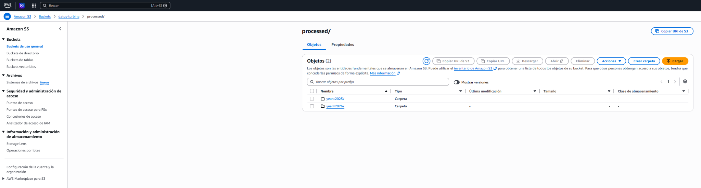{#fig-s3-processed fig-cap="Amazon S3: validación del bucket y prefijos temporales en `processed/`." width="90%" fig-align="center" fig-pos="H"}

Se verifica el bucket `datos-turbina` y la estructura de carpetas/prefijos temporales dentro de `processed/`, evidenciando la persistencia del histórico.

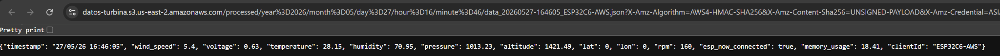{#fig-s3-json-object fig-cap="Amazon S3: verificación de un objeto json  almacenado en el histórico." width="90%" fig-align="center" fig-pos="H"}

Se inspecciona un archivo json específico almacenado en S3 y se confirma su contenido y consistencia con el contrato de datos.

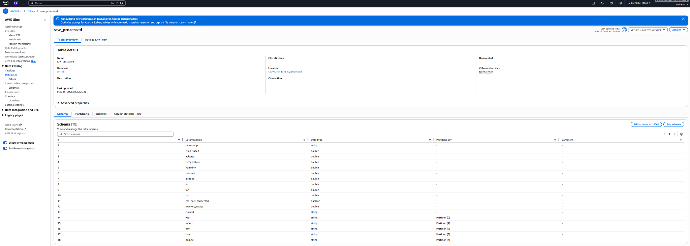{#fig-glue-table fig-cap="AWS Glue Data Catalog: verificación de la tabla y del esquema." width="90%" fig-align="center" fig-pos="H"}

Se verifica que AWS Glue reconoce el esquema de la tabla que referencia el histórico en S3, habilitando consultas posteriores en Athena.

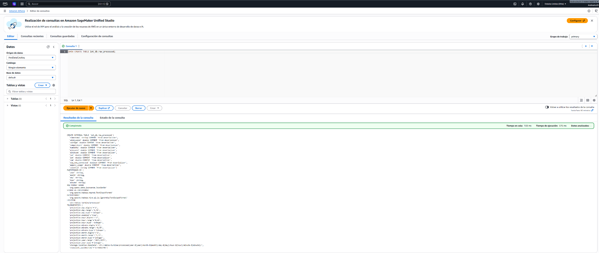{#fig-athena-consulta fig-cap="Amazon Athena: ejecución de una consulta básica sobre el histórico." width="90%" fig-align="center" fig-pos="H"}

Se ejecuta una consulta en Athena para confirmar que los datos almacenados en S3 son consultables y que la ruta histórica funciona conforme a lo esperado.

**Síntesis de la prueba.** La secuencia presentada permite seguir el dato almacenado en S3, su esquema en Glue y la consulta ejecutada en Athena. Se comprueba así el funcionamiento de la ruta histórica para el caso mostrado, sin evaluar todavía su rendimiento con grandes volúmenes de datos.

```{=latex}
\FloatBarrier
```

### Evidencias (Prueba Lambda)

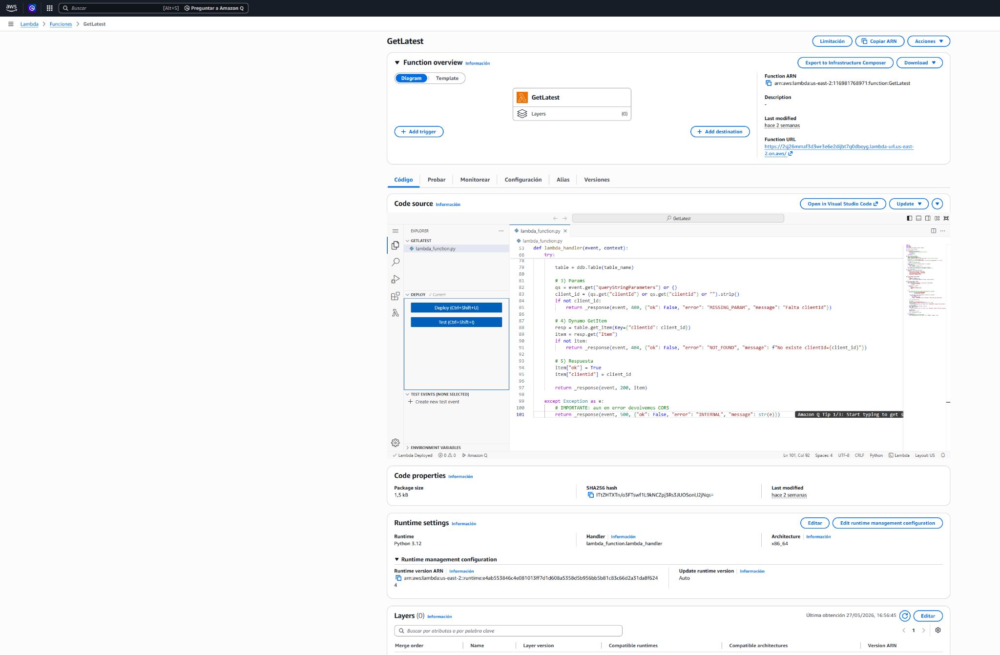{#fig-lambda-getlatest fig-cap="AWS Lambda (GetLatest): verificación de la Function URL para consulta del último dato." width="90%" fig-align="center" fig-pos="H"}

Se verifica la función `GetLatest` y su Function URL, validando que la API devuelve el último paquete disponible para un `clientId`.

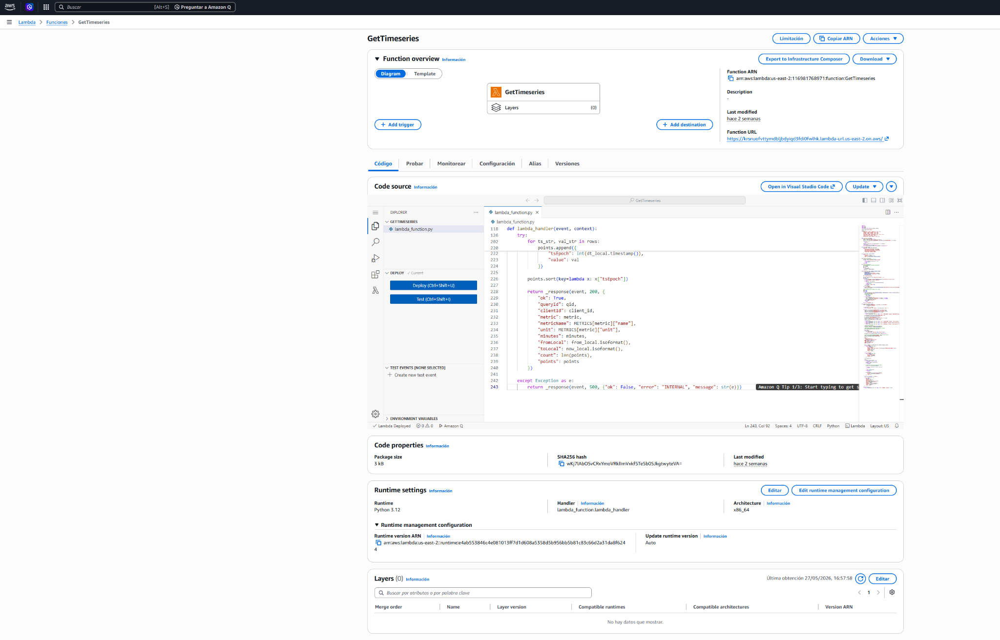{#fig-lambda-gettimeseries fig-cap="AWS Lambda (GetTimeseries): verificación de la Function URL para consulta histórica." width="90%" fig-align="center" fig-pos="H"}

Se verifica la función `GetTimeseries` y su Function URL, confirmando la respuesta JSON para series temporales parametrizadas por métrica y ventana de tiempo.

**Síntesis de la prueba.** Las pruebas de GetLatest y GetTimeseries muestran las dos formas de acceso a los datos: el último paquete y la serie histórica solicitada. Las respuestas JSON permiten enlazar el almacenamiento con la visualización sin que el usuario tenga que consultar los servicios desde la consola de AWS.

```{=latex}
\FloatBarrier
```

### Evidencias (Prueba Dashboard)

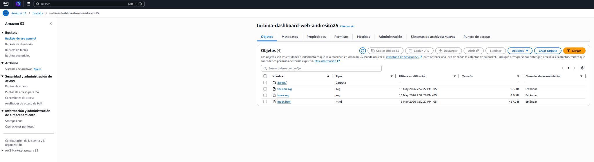{#fig-s3-web fig-cap="Dashboard web: alojamiento del frontend en Amazon S3." width="90%" fig-align="center" fig-pos="H"}

Se valida el despliegue del dashboard estático en S3, confirmando la disponibilidad de los artefactos del frontend.

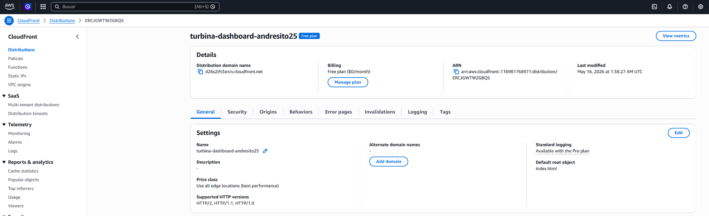{#fig-cloudfront-distribution fig-cap="CloudFront: distribución configurada para servir el dashboard con baja latencia." width="90%" fig-align="center" fig-pos="H"}

[@ref21; @quincoces_mqtt_2019; @botta_cloud_iot_2016]

Se verifica la distribución de CloudFront que expone el dashboard, evidenciando la capa de entrega (CDN) sobre el contenido estático.

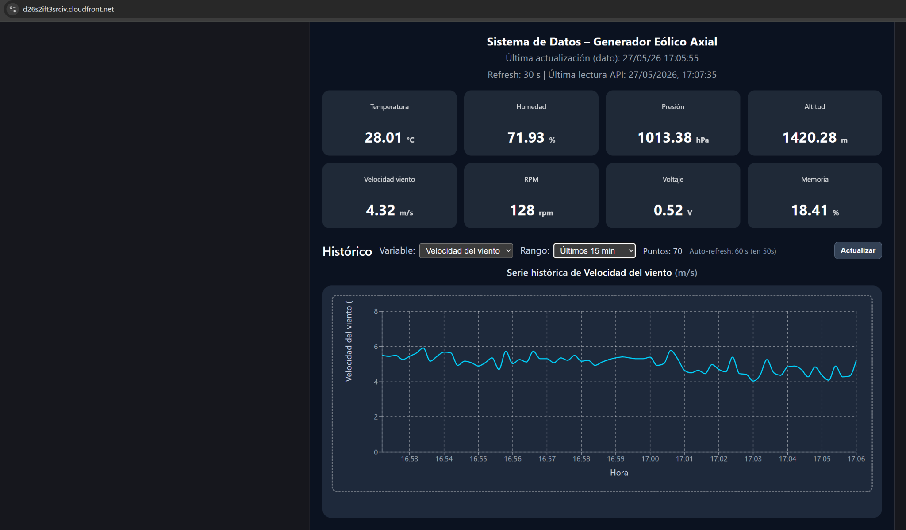{#fig-dashboard-15min fig-cap="Dashboard: consulta de últimos 15 minutos para velocidad del viento." width="82%" fig-align="center" fig-pos="H"}

Se valida en el dashboard la consulta histórica (últimos 15 minutos) para la variable de velocidad del viento, confirmando la integración con `GetTimeseries` y el renderizado de la serie.

**Síntesis de la prueba.** Las evidencias del dashboard muestran el despliegue del frontend y una consulta de los últimos 15 minutos para velocidad del viento. El resultado permite comprobar la integración con GetTimeseries y la representación de la serie correspondiente.

```{=latex}
\begin{samepage}
```

## Síntesis del capítulo

Las pruebas documentadas permiten seguir el recorrido de la telemetría desde las tarjetas hasta el dashboard. Las desconexiones controladas muestran qué ocurre cuando falta un nodo y las evidencias de AWS permiten revisar la recepción, persistencia y consulta de los datos. Esta secuencia facilita ubicar el tramo que debe revisarse cuando la información deja de llegar.

El alcance de las evidencias corresponde a las condiciones y consultas presentadas. No constituye una medición prolongada de disponibilidad, pérdida de paquetes o desempeño bajo carga. A partir de este funcionamiento comprobado, el capítulo siguiente analiza los parámetros que intervienen en los costos y el escalamiento del sistema.

```{=latex}
\end{samepage}
```
